# Attention in LLM

<a id="toc"></a>
## 目录

- [1. 引言：为什么 Attention 是 LLM 的瓶颈](#intro)
- [2. Scaled Dot-Product Attention](#scaled-dot-product-attention)
  - [2.1 Scaled Dot-Product Attention](#scaled-dot-product-formula)
  - [2.2 Multi-Head Attention (MHA)](#mha)
- [3. KVCache](#kvcache)
  - [3.1 Causal Attention 与 KV Cache](#causal-attention-kv-cache)
  - [3.2 Prefill vs Decode](#prefill-vs-decode)
- [4. Head/KV 表示压缩](#kv-compression)
  - [4.1 Multi-Query Attention (MQA)](#mqa)
  - [4.2 Grouped-Query Attention (GQA)](#gqa)
  - [4.3 Multi-Head Latent Attention (MLA)](#mla)
- [5. 长上下文 Attention 压缩](#long-context-attention-compression)
  - [5.1 Sliding Window Attention (SWA)](#swa)
  - [5.2 DeepSeek Sparse Attention (DSA)](#dsa)
  - [5.3 DeepSeek-V4 Hybrid Attention](#deepseek-v4-hybrid)
  - [5.4 Gated DeltaNet (GDN)](#linear-attention-gdn)
- [6. 典型 LLM 的 Attention 选型](#llm-attention-choices)
  - [6.1 模型速览](#llm-attention-table)
  - [6.2 几个趋势](#llm-attention-trends)
- [7. Kernel / 系统优化](#kernel-system-optimization)
  - [7.1 FlashAttention](#flashattention)
  - [7.2 PagedAttention](#pagedattention)
  - [7.3 RadixAttention](#radixattention)
  - [7.4 Ring Attention](#ring-attention)
  - [7.5 FlexAttention](#flexattention)
- [8. References](#references)

<a id="intro"></a>
## 1. 引言：为什么 Attention 是 LLM 的瓶颈

当前主流 LLM 仍然以 Decoder-only Transformer 为基本骨架。Attention Layer 是这个骨架里最特殊的一层：Embedding、LayerNorm、MLP、LM Head 基本都是 token-wise 的线性/非线性变换，而 Attention 会显式地把当前 token 和历史 token 建立连接。

这也是 LLM 训练和推理优化里绕不开 Attention 的原因：

- Prefill 阶段需要处理完整 prompt，基于Softmax Dot Product Attention 的 score 矩阵大小是 $`S \times S`$，计算复杂度随序列长度二次增长。
- Decode 阶段每次只生成一个 token，计算量看起来是 $`O(S)`$，但必须从 HBM 读取历史 KV Cache，瓶颈经常从算力转为显存容量和显存带宽。
- 长上下文会同时放大两类问题：prefill 的 quadratic compute 和 decode 的 KV Cache 读写。

理解这些机制，可以从一个问题出发：标准 causal attention 需要让当前 token 读取全部历史信息，而 KV Cache 虽然避免了重复计算，却让长上下文推理越来越受显存和带宽限制。后续各种 attention 变体的差异，主要就在于它们选择压缩什么：压缩 KV 表示、稀疏化历史连接、把历史写成 recurrent state，或者优化 exact attention 的 kernel IO。

下面统一使用这些符号：

- $`B`$: batch size
- $`S`$: sequence length
- $`D`$: hidden size
- $`H_q`$: query heads 数量
- $`H_{kv}`$: key/value heads 数量
- $`d`$: head dim，通常 $`D = H_q d`$

<a id="scaled-dot-product-attention"></a>
## 2. Scaled Dot-Product Attention

<a id="scaled-dot-product-formula"></a>
### 2.1 Scaled Dot-Product Attention

标准 Attention 的输入是 Query、Key、Value：

$$
Q = XW_Q,\quad K = XW_K,\quad V = XW_V
$$

单头 Attention 的计算为：

$$
\text{Attn}(Q,K,V)
{}={}
\text{softmax}\bigl(\frac{QK^T}{\sqrt{d}} + M\bigr)V
$$

其中 $`M`$ 是 mask。在 Decoder-only LLM 中，$`M`$ 通常是 causal mask，保证第 $`i`$ 个 token 只能看到 $`\le i`$ 的 token，不能看到未来 token。

如果 $`q`$ 和 $`k`$ 的每个维度近似独立，方差为 1，那么点积 $`q \cdot k`$ 的方差会随 $`d`$ 增大。直接把 $`QK^T`$ 输入 softmax，容易让 softmax 饱和，梯度变小。除以 $`\sqrt{d}`$ 的作用是稳定 score 的尺度，让训练更稳定。

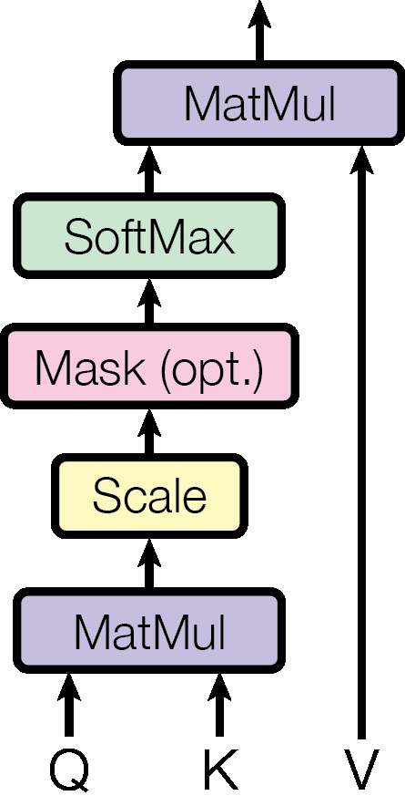

*图片来源：[Attention Is All You Need, Figure 2](https://arxiv.org/abs/1706.03762)*

<a id="mha"></a>
### 2.2 Multi-Head Attention (MHA)

MHA 是 Transformer 原始论文中的标准形式。它把 hidden state 切分为多个 head，每个 head 独立做 Attention，最后 concat 后经过输出投影：

$$
\text{head}_i
{}={}
\text{Attn}(XW_Q^{(i)}, XW_K^{(i)}, XW_V^{(i)})
$$

$$
\text{MHA}(X)
{}={}
\text{Concat}(\text{head}_1,\ldots,\text{head}_{H_q})W_O
$$

对于 MHA，通常有：

$$
H_{kv}=H_q
$$

也就是每个 query head 都有自己独立的 K/V head。

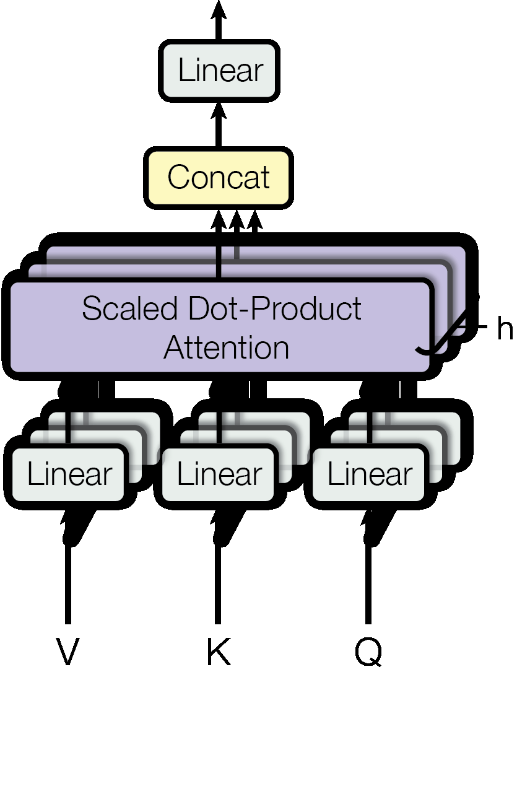

*图片来源：[Attention Is All You Need, Figure 2](https://arxiv.org/abs/1706.03762)*

单头 Attention 只能在一个表示子空间里计算 token 间关系。MHA 则允许不同 head 学到不同的关系模式，例如局部依赖、长距离依赖、语法关系、实体指代等。

从矩阵视角看，MHA 不是简单地把一个大 head 拆小，而是为每个 head 引入独立的 $`W_Q,W_K,W_V`$ 投影，让不同 head 在不同表示空间里构造不同的相似度矩阵。

MHA 的优点是表达能力强，训练稳定，是最自然的 attention baseline。它的代价会在 decode 阶段集中体现：系统需要为每层每个 token 保留 $`H_q`$ 组 K/V，因此 MHA 也是后面分析 KV Cache 容量和访存压力的基线。


<a id="kvcache"></a>
## 3. KVCache

KVCache 是 Decoder-only LLM 推理中最核心的机制之一。它利用 causal mask 下“历史 token 的输出不会被未来 token 改变”这一性质，把逐 token decode 从反复重算完整上下文，变成只计算当前 token 并复用历史 K/V。这个机制大幅降低了重复计算，但也让长上下文推理越来越受 KV Cache 容量和 HBM 读取带宽限制。

理解 KVCache 之后，后面的 MQA/GQA/MLA、SWA/DSA、PagedAttention/RadixAttention 才更容易串起来：它们本质上都在回答如何更少地保存、读取、组织或复用历史 KV。

<a id="causal-attention-kv-cache"></a>
### 3.1 Causal Attention 与 KV Cache

Decoder-only LLM 的推理是自回归生成：每一步把新 token append 到已有序列末尾，再预测下一个 token。

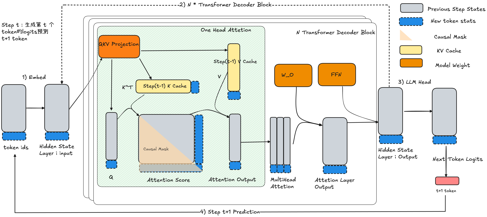

KV Cache 能 work 的根本原因是：**append 新 token 后，历史 token 在每一层的 hidden state 和 attention output 不会改变**。

这来自两个事实：

- Embedding、RoPE、LayerNorm、MLP、LM Head 等大多数子层是 token-wise 计算。新增 token 不会改写历史 token 的这些层输出。
- Causal mask 禁止历史 query 看到未来 key。新增 token 对历史 token 来说是未来 token，因此历史 token 的 attention output 不会被新增 token 影响。

用 attention weight $`A`$ 看这件事最直观。把序列按“历史 token / 新 token”分块：

$$
A =
\begin{bmatrix}
A_{\text{hist}\to\text{hist}} & 0 \\
A_{\text{new}\to\text{hist}} & A_{\text{new}\to\text{new}}
\end{bmatrix}
$$

右上角为 0，表示历史 token 不能 attend 到新增 token。因此第 $`t`$ 步只有最后一行/最后一个 token 的 attention output 是新计算出来的；历史部分只是沿用上一轮结果。

更具体地看历史部分的输出。Attention output 是 $`O = A V`$，其中 $`V`$ 也可以按历史 token / 新 token 分块, 因此第 $`t`$ 步历史 token 对应的输出为：

$$
O_{\text{hist}}^{(t)}
=
\begin{bmatrix}
A_{\text{hist}\to\text{hist}} & 0
\end{bmatrix}
\begin{bmatrix}
V_{\text{hist}} \\
V_{\text{new}}
\end{bmatrix}
=
A_{\text{hist}\to\text{hist}}V_{\text{hist}}
=
O_{\text{hist}}^{(t-1)}
$$

因为 causal mask 让 $`A_{\text{hist}\to\text{new}} = 0`$。 新增 token 只会产生新的 attention output 行，不会改变已经算过的 $`O_{\text{hist}}`$。

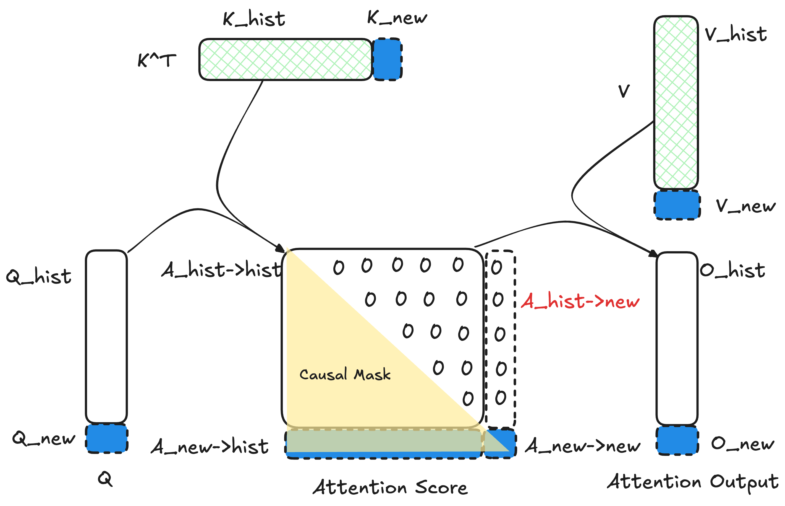

因此 decode 阶段不需要重新计算完整序列的所有 Q/K/V 和 attention output。真正需要做的是：

1. 计算当前 token 的 $`q_t,k_t,v_t`$。
2. 将 $`k_t,v_t`$ append 到历史 KV Cache。
3. 用当前 query $`q_t`$ attend 到完整的 $`K_{1:t},V_{1:t}`$，得到当前 token 的输出。

当前 token 的 attention 可以简化写成：

$$
o_t
{}={}
\text{softmax}\bigl(q_t K_{1:t}^T / \sqrt{d}\bigr)V_{1:t}
$$

这也解释了为什么通常只有 KV Cache，没有 Q Cache：decode 第 $`t`$ 步只需要当前 token 的 $`q_t`$；历史 query 不会参与当前 token 的输出计算，也不需要缓存。

这就是 KV Cache 的理论基础。它把每步 decode 从“重算所有历史 token 的 K/V”变成“复用历史 K/V”，用显存换计算量；但代价是 KV Cache 会随 $`B,S,L,H_{kv},d`$ 线性增长。若数据类型大小为 $`b`$ bytes，全模型 KV Cache 规模约为：

$$
\text{KVCache}
\approx
2 \times B \times S \times L \times H_{kv} \times d \times b
$$

其中 2 分别对应 K 和 V，$`L`$ 是层数；对 MHA 来说 $`H_{kv}=H_q`$，FP16/BF16 下 $`b=2`$。这也是为什么大模型服务中，长上下文和大 batch 往往首先撞到 KV Cache 显存容量和 HBM 读取带宽瓶颈，而不是单纯的权重显存瓶颈。后续 MQA/GQA/MLA 的核心目标之一，就是降低这个式子里的 $`H_{kv}`$ 或把 $`H_{kv}d`$ 压缩成更小的 latent 维度。

<a id="prefill-vs-decode"></a>
### 3.2 Prefill 与 Decode

KV Cache 也解释了 LLM 推理中 Prefill 和 Decode 的区别。

**Prefill** 发生在一个新请求刚进入模型时。此时没有历史 cache，模型必须对完整 prompt 做一次 forward，计算所有 prompt token 在每一层的 K/V，并写入 KV Cache。Prefill 阶段的 attention 仍然要处理完整 causal attention 矩阵，计算量主要受 prompt 长度影响。

**Decode** 发生在后续逐 token 生成时。每一步只输入上一步新生成的 token，计算当前 token 的 $`q_t,k_t,v_t`$，把 $`k_t,v_t`$ 追加到 cache，然后用 $`q_t`$ attend 到历史所有 K/V。Decode 阶段单步计算量从 full sequence 重算变成 $`O(S)`$ 的 attention，但每步都要读取长度为 $`S`$ 的 KV Cache，因此长上下文下通常更受 HBM 读取和 KV Cache 容量限制。

所以 KV Cache 的本质不是改变 attention 的数学结果，而是利用 causal mask 下“历史输出不变”的性质，避免重复计算历史 token 的 K/V 和历史 attention output。

根据 attention 机制主要优化的对象，本文将Attention Layer的优化分为两类：

1. **每个历史 token 存什么**：以 MHA 为 baseline，MQA/GQA/MLA 主要压缩 KV 表示，降低 decode 阶段 KV Cache 容量和 HBM 读取。
2. **每个 query 读多少历史**：SWA/DSA/DeepSeek-V4 主要减少每个 query 实际访问的历史 token/block；GatedDeltaNet 则把历史 token-level KV Cache 压成 recurrent state。

<a id="kv-compression"></a>
## 4. Head/KV 表示压缩

本节以 MHA 为 baseline，讨论如何在不改变 causal attention 基本连接关系的前提下，压缩历史 K/V 的 head 数量或缓存表示，从而降低 decode 阶段 KV Cache 的容量和 HBM 读取。

<a id="mqa"></a>
### 4.1 Multi-Query Attention (MQA)

MQA 最早由 *Fast Transformer Decoding: One Write-Head is All You Need* 提出。它的核心变化是：保留多个 Query heads，但所有 Query heads 共享同一组 K/V。


*图片来源：[GQA: Training Generalized Multi-Query Transformer Models from Multi-Head Checkpoints, Figure 2](https://arxiv.org/abs/2305.13245)*

decode 阶段每步只处理一个 query token，主要瓶颈不是 $`q_t`$ 的计算，而是读取历史 $`K,V`$。MHA 中每个 query head 都有独立 K/V，导致每步 decode 要读 $`H_q`$ 份历史 K/V。MQA 可以看成把 $`H_{kv}`$ 压到 1：每层每 token 的 KV Cache 从 MHA 的约 $`2H_qd`$ 个元素降到约 $`2d`$ 个元素，相对比例约为 $`1/H_q`$。

这会直接带来：

- 更低的显存占用。
- decode 阶段更少的 HBM 读取。
- 更大的 serving batch size。
- 更高的长上下文吞吐。

代价是 K/V 表示被强制共享，表达能力下降。尤其是在较大模型或复杂任务中，所有 query heads 使用同一套 K/V 可能不足以承载丰富的检索模式，模型质量可能低于 MHA。

因此，MQA 是一个非常激进的推理优化：吞吐收益大，但质量风险也更高。

<a id="gqa"></a>
### 4.2 Grouped-Query Attention (GQA)

GQA 是 MHA 和 MQA 之间的折中。它把 $`H_q`$ 个 query heads 分成 $`H_{kv}`$ 组，每组 query heads 共享一组 K/V。

假设 $`H_q=32, H_{kv}=8`$，那么每 4 个 query heads 共享一组 K/V：

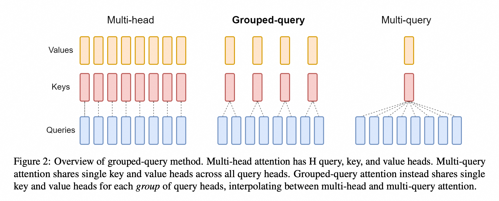

*图片来源：[GQA: Training Generalized Multi-Query Transformer Models from Multi-Head Checkpoints, Figure 2](https://arxiv.org/abs/2305.13245)*

特殊情况：

- 当 $`H_{kv}=H_q`$，GQA 退化为 MHA。
- 当 $`H_{kv}=1`$，GQA 退化为 MQA。

MQA 的问题是共享太强，质量可能下降。MHA 的问题是 KV Cache 太大。GQA 的目标是在二者之间找一个更好的工程点：让几个 query heads 共享一套 K/V，但不要让所有 query heads 都共享同一套 K/V。

从 cache 角度看，GQA 的每层每 token KV Cache 约为 $`2H_{kv}d`$ 个元素，相对 MHA 的比例约为 $`H_{kv}/H_q`$。例如 $`H_q=32,H_{kv}=8`$，KV Cache 约为 MHA 的 25%。相比 MQA，它多保留了几组 K/V 表示，质量通常更接近 MHA；相比 MHA，它显著降低了 decode 访存。因此，GQA 通常是质量和 serving 成本之间的稳健折中。

<a id="mla"></a>
### 4.3 Multi-Head Latent Attention (MLA)

MLA 是 DeepSeek-V2 引入的 attention 结构。它的出发点不是继续减少 KV heads，而是借鉴 LoRA 的低秩分解思路，把每个 token 需要缓存的 K/V 表示压到一个更小的 latent space。

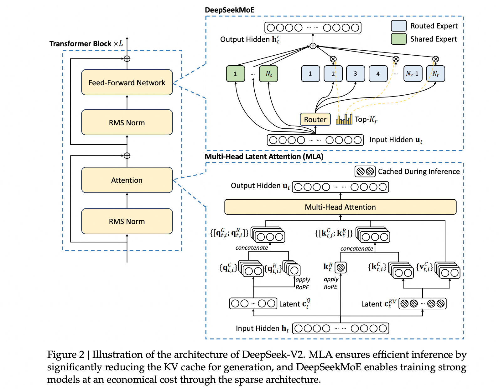

*图片来源：[DeepSeek-V2, Figure 3](https://arxiv.org/html/2405.04434v5/x3.png)*

#### 计算机制

MQA/GQA 主要通过减少 K/V heads 的数量来压缩 KV Cache：MHA 保存 $`H_q`$ 组 K/V，GQA 保存 $`H_{kv}`$ 组 K/V，MQA 只保存 1 组 K/V。

MLA 换了一个方向：即使保留多 query heads，也不一定要把每个 token 的历史 K/V 按 per-head 形式完整保存下来。它先把 K/V 投影到更低维的 latent 表示中缓存，需要参与 attention 时再恢复到各个 head 的表示空间。因此，MLA 压缩的是每个 token 存下来的 K/V 表示维度。

先暂时不考虑位置编码，MLA 的主干可以看成一个低秩 K/V 分解：每个 token 先通过 down-projection 得到一份共享 latent KV：

$$
c_t^{KV} = x_t W_{DKV}
$$

需要参与 attention 计算时，再通过 up-projection 从 latent 中恢复每个 head 的 non-RoPE key/value：

$$
k_{t,h}^{nope} = c_t^{KV} W_{UK,h},
\quad
v_{t,h} = c_t^{KV} W_{UV,h}
$$

推理时，KV Cache 里主要保存这份低维 latent，而不是为每个 head 保存完整 K/V。MLA 在逻辑上仍然可以得到每个 head 自己的 K/V 表示，但物理缓存的是更小的 $`c_t^{KV}`$；per-head K/V 是从 latent 临时使用或恢复出来的，而不是长期写入 KV Cache。

#### RoPE 支持

RoPE 带有位置相关旋转，不能简单混入上面的低秩 latent 路径，所以 DeepSeek-style MLA 会把 non-RoPE key/value 和 RoPE key 分开：non-RoPE 部分走 latent 路径，RoPE key 单独计算和缓存。

最终每个 head 的 query/key 可以看成由两段拼接而成：

$$
k_{t,h} = [k_{t,h}^{nope}; k_t^R],
\quad
q_{t,h} = [q_{t,h}^{nope}; q_{t,h}^{R}]
$$

对应的 attention score 也分成两部分相加：

$$
s_{t,j,h}
{}={}
q_{t,h}^{nope} \cdot k_{j,h}^{nope}
+
q_{t,h}^{R} \cdot k_j^R
$$

这里的 $`q_{t,h}^{nope} \cdot k_{j,h}^{nope}`$ 走 latent 路径，$`q_{t,h}^{R} \cdot k_j^R`$ 负责注入 RoPE 位置信息。这个拆分也是后面矩阵吸收能成立的前提：non-RoPE 部分可以直接查询 latent cache，RoPE 部分则保留独立的 key cache。

于是 MLA 的 decode cache 不是 per-head K/V，而是低维 latent KV 加上一小段 RoPE key。设 latent 维度为 $`d_c`$，RoPE key 维度为 $`d_R`$，每层每 token 的 cache 直觉上可以看成：

$$
\text{cache/token}_{MLA} \approx d_c + d_R
$$

这相当于把标准 KV Cache 里的 $`2H_{kv}d`$ 换成 $`d_c+d_R`$。这里没有前面的 2，是因为 $`c^{KV}`$ 同时承担 non-RoPE K 和 V 的压缩缓存，RoPE key 则单独保存。

以 DeepSeek-V3/R1 类配置为例，`n_heads=128`，`kv_lora_rank=512`，`v_head_dim=128`，`qk_rope_head_dim=64`。如果按 per-head 形式保存 value，仅 V 的维度就是 $`128 \times 128 = 16384`$；non-RoPE key 也有同量级的 per-head 展开开销。MLA 的 decode cache 主要保存 512 维 latent KV 和 64 维 RoPE key，cache 维度差异非常明显。

#### Decode 阶段的矩阵吸收

只压缩 KV Cache 还不够。如果 decode 时每一步都把全部历史 $`c_j^{KV}`$ 展开成 per-head K/V，再做 attention，那么 cache 存储虽然变小了，但每步仍会产生大量历史 K/V 展开和读取。

直觉上，non-RoPE key 的 up-projection 可以从历史 key 侧“移到”当前 query 侧：当前 query 先变换到 latent 对应的打分空间，然后直接和历史缓存的 $`c_j^{KV}`$ 做点积。

关键等价关系可以简化写成：

$$
q_{t,h}^{nope}(c_j^{KV}W_{UK,h})^T
{}={}
(q_{t,h}^{nope}W_{UK,h}^T)(c_j^{KV})^T
$$

也就是把历史侧的 key projection 吸收到当前 query 侧，避免每一步为全部历史 token 展开 $`K=C^{KV}W^{UK}`$ 的大矩阵。

Value 侧也可以做类似处理。由于每个 head 的 value 同样由 latent up-projection 得到：

$$
v_{j,h}=c_j^{KV}W_{UV,h}
$$

attention output 可以先在 latent cache 上聚合，再做 value up-projection：

$$
o_{t,h}
{}={}
\sum_j a_{t,j,h}v_{j,h}
{}={}
\bigl(\sum_j a_{t,j,h}c_j^{KV}\bigr)W_{UV,h}
$$

因此，矩阵吸收的收益主要来自减少 HBM 读写和临时张量物化：历史侧只保存和读取 latent KV，不展开、不写回 per-head K/V。

#### Prefill 与 Decode 的计算路径

矩阵吸收并不是在所有阶段都更划算。训练 / prefill 中有大量 query token，先展开 K/V 后走 dense attention kernel，通常更容易获得高吞吐；decode 中每步只有一个新 query，瓶颈更偏向反复读取和展开历史 KV，这时直接查询 latent cache 更合适。

下面只看 non-RoPE key score 路径，用 DeepSeek-V3/R1 类配置做一个量级对比：

- $`s`$: 当前 query token 数，decode 中 $`s=1`$。
- $`t`$: 被 attend 的历史 / 上下文 token 数。
- $`d_c=512`$: `kv_lora_rank`，即 latent KV 维度。
- $`d_{nope}=128`$: `qk_nope_head_dim`，即每个 head 的 non-RoPE key 维度。

如果先展开 K，再做 MHA-like score，核心成本近似为：

$$
2(t \cdot 512 \cdot 128 + s \cdot t \cdot 128)
{}={}
131072t + 256st
$$

如果矩阵吸收后直接和 latent cache 做 score，核心成本近似为：

$$
2(s \cdot 512 \cdot 128 + s \cdot t \cdot 512)
{}={}
131072s + 1024st
$$

| 场景 | 设定 | 先展开 K/V | 矩阵吸收 |
| --- | --- | ---: | ---: |
| 训练 / prefill | $`s=t=163840`$ | 约 $`6.89`$ TFLOPs | 约 $`27.51`$ TFLOPs |
| decode | $`s=1,t=163840`$ | 约 $`21517`$ MFLOPs | 约 $`168`$ MFLOPs |

可以看出，训练 / prefill 中 $`s,t`$ 都大，矩阵吸收会把 score 的内积维度从 $`128`$ 提到 $`512`$，所以未必更划算；decode 中 $`s=1`$，不吸收则每步都要为 $`t`$ 个历史 token 展开 K，矩阵吸收只需要对当前 query 做一次变换，然后直接查询 latent cache。

因此，MLA 的关键可以概括为“双模”：

- decode 采用MQA: 只有一个KV Cache，减少长上下文下的 KV Cache 访存和显存压力。
- 训练 / prefill 采用MHA: 保留高吞吐计算；

#### 小结：几种 KV 压缩的差异

| 机制 | 压缩对象 | kv cache per token/ per layer | 主要收益 | 主要代价 |
| --- | --- | --- | --- | --- |
| MHA | 不压缩 | $`2H_qd`$ | 表达能力强，训练稳定 | KV Cache 最大 |
| MQA | KV heads 数量 | $`2d`$ | decode 访存最低 | K/V 共享过强，质量风险更高 |
| GQA | KV heads 数量 | $`2H_{kv}d`$ | 质量和成本的稳健折中 | 仍按 KV head 保存历史 K/V |
| MLA | KV 表示维度 | $`d_c+d_R`$ | 兼具MHA-like的表达能力和MQA-Like的访存效率 | - |

<a id="long-context-attention-compression"></a>
## 5. 长上下文 Attention 压缩

前面 MQA/GQA/MLA 主要压缩“每个历史 token 存什么”。但长上下文的另一个问题是：当前 query 是否真的需要访问所有历史 token。围绕这个问题，模型侧还有两条常见路线。

第一类仍然保留 softmax attention，只是减少每个 query 实际访问的历史范围。SWA 用固定窗口限制局部上下文，DSA 动态选择重要 token 或 block，DeepSeek-V4 则先压缩序列长度，再在压缩后的表示上做 sparse / compressed attention。

第二类不再显式维护完整 token-level KV Cache，而是把历史信息写入固定或近似固定大小的 recurrent state。GatedDeltaNet 是这条路线的代表。前者压缩的是 attention 连接集合或序列长度，后者压缩的是历史记忆表示。

<a id="swa"></a>
### 5.1 Sliding Window Attention (SWA)

标准 full attention 中，第 $`i`$ 个 token 可以 attend 到所有历史 token：

$$
j \le i
$$

SWA 只允许它 attend 到最近 $`W`$ 个 token：

$$
i-W \lt j \le i
$$

Attention mask 从完整的下三角矩阵变成一条宽度为 $`W`$ 的 band：

$$
O_i
{}={}
\text{Attn}(q_i,K_{i-W:i},V_{i-W:i})
$$

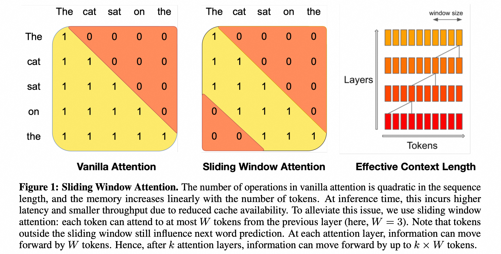

*图片来源：[Mistral 7B, Figure 1](https://arxiv.org/abs/2310.06825)*

#### 成本收益

语言模型中大量依赖是局部的：短语、句法、局部代码块、相邻推理步骤都主要依赖近邻 token。对于很长上下文，强制每一层每个 token 都 attend 到所有历史 token，成本很高，并且很多连接的边际收益并不大。

SWA 的思路是牺牲每层的全局可见性，换取更低成本：

- prefill 从 $`O(S^2)`$ 降到 $`O(SW)`$。
- decode 每步只需要读最近 $`W`$ 个 token 的 KV。
- KV Cache 可以配合 rolling window，只保留局部窗口。

SWA 在所有相关层都严格只看最近 $`W`$ 个 token，在推理系统实现 rolling window KV Cache 后，每一轮 decode 会逐出一个 token 的 KV Cache，那么每层只需要保留最近窗口。若所有 $`L`$ 层都采用同一窗口，KV Cache 不再随上下文长度 $`S`$ 线性增长，而是固定在窗口大小 $`W`$ 上：

$$
\text{KVCache}_{SWA}
\approx
2 \times B \times W \times L \times H_{kv} \times d \times b
$$

相对 full attention 的 cache 比例约为：

$$
\frac{W}{S}
$$

#### Hybrid pattern 与局限

实际模型经常采用 hybrid pattern：

- 大部分层使用 local/sliding window attention，降低成本。
- 少量层使用 global/full attention，补充全局信息流。
- 或者交替使用 dense attention 和 banded attention。

这种设计比纯 SWA 更稳健：局部层负责高频近邻依赖，全局层负责跨段检索和全局聚合。

如果模型采用 local/global hybrid pattern，整体 KV Cache 介于 full attention 和纯 SWA 之间。粗略地，如果 $`L_{local}`$ 层使用窗口 $`W`$，$`L_{global}`$ 层使用完整上下文 $`S`$，总 cache 与 full attention 的比例约为：

$$
\frac{L_{local}W + L_{global}S}{(L_{local}+L_{global})S}
$$

SWA 的关键风险是长距离信息传递。单层 SWA 看不到窗口外的 token，但多层堆叠后，信息可以逐层向后传播。假设窗口大小为 $`W`$，层数为 $`L`$，理论上信息传播范围可以随 $`LW`$ 扩大。

Mistral 7B 是 SWA + GQA 的代表模型之一。它用 SWA 降低长序列推理成本，同时通过层间信息传递保留更长范围的上下文影响。


<a id="dsa"></a>
### 5.2 DeepSeek Sparse Attention (DSA)

DSA 是 DeepSeek-V3.2 引入的 sparse attention 机制，具体落在 DeepSeek-V3.2 的 MLA 架构上：MLA 已经压缩了 KV 表示，但 full attention 仍然需要让当前 query 访问完整历史 latent KV；DSA 则用一个轻量 **lightning indexer** 先选出少量相关 KV entries，再只对这些 selected K/V 做主 attention，从而降低长上下文下的主 attention 计算和 HBM 读取。

和固定 SWA 不同，DSA 的 selected set 会随 query 动态变化，因此可以选择远处但相关的 token；它也不是推理时临时加一个 pruning mask，而是在 continued pre-training 中让模型适应 sparse pattern。DeepSeek-V3.2 是从 DeepSeek-V3.1-Terminus 继续训练得到的，论文中明确说，相比 V3.1-Terminus，V3.2 的唯一架构修改就是通过 continued training 引入 DSA。

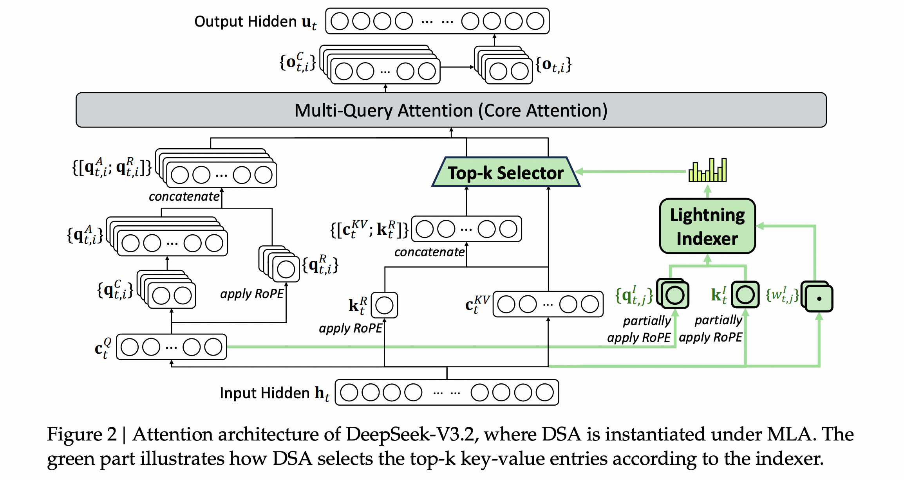

*图片来源：[DeepSeek-V3.2, Figure 2](https://arxiv.org/abs/2512.02556)*

#### 计算机制

DSA 原型由两部分组成：

1. **Lightning indexer**：计算 query token 和历史 token / KV entry 之间的 index score。
2. **Fine-grained token selection**：根据 index score 选择 top-$k$ KV entries，再用这些 selected K/V 做主 attention。

论文中把第 $t$ 个 query token $\mathbf{h}_t$ 和第 $s$ 个历史 token $\mathbf{h}_s$ 的 index score 写成：

$$
I_{t,s}
{}={}
\sum_{j=1}^{H^I}
w_{t,j}^{I}\cdot
\text{ReLU}(\mathbf{q}_{t,j}^{I}\cdot \mathbf{k}_{s}^{I})
$$

其中 $H^I$ 是 indexer heads 数量；$\mathbf{q}_{t,j}^{I}$ 和 $w_{t,j}^{I}$ 来自当前 query token，$\mathbf{k}_{s}^{I}$ 来自历史 token。这里使用 ReLU、较少 indexer heads 和 FP8，是为了让全历史打分足够便宜。

有了 $I_{t,s}$ 之后，DSA 只取 top-$k$ 对应的 KV entries：

$$
\mathcal{S}_t
{}={}
\lbrace
s
\mid
I_{t,s}\in \text{Top-k}(I_{t,:})
\rbrace
$$

最终主 attention 仍然是 softmax attention，只是 K/V 集合从完整历史变成 selected set。由于 DSA 在 DeepSeek-V3.2 中基于 MLA 实例化，这里的 $\mathbf{c}_s$ 可以理解为 MLA 的 latent KV entry：

$$
\mathbf{u}_t
{}={}
\text{Attn}
(
\mathbf{h}_t,
\lbrace
\mathbf{c}_s
\mid
s\in\mathcal{S}_t
\rbrace
)
$$

在 DeepSeek-V3.2 中，DSA 是 **instantiated under MLA**，并基于 MLA 的 **MQA mode** 实现：每个 latent vector 作为 key-value entry，被当前 query token 的所有 query heads 共享。这样可以避免不同 heads 各自选择 top-k 后让实际读取集合膨胀。

训练上，DeepSeek-V3.2 也不是直接把 dense attention 切成 sparse attention，而是分两步引入 DSA：

1. **Dense warm-up**：保持 dense attention，只训练 lightning indexer，让 indexer 分布对齐主 attention 分布。
2. **Sparse training**：启用 top-k token selection，主模型和 indexer 一起继续训练，让模型适应 sparse pattern。

这也是 DSA 和推理时临时 pruning 的关键区别：selection pattern 是训练出来的，而不是事后加一个 top-k mask。

#### 计算缓存分析

DSA 的关键点不是压缩 KV Cache 的存储长度，而是在softmax attention 前增加 lightning indexer + token selection，改变softmax attention 实际加载的历史 KV entries。

在存储上，历史 token 的 MLA latent KV、RoPE 相关 key 仍然需要按 token 保存；同时 lightning indexer 还需要额外保存轻量 indexer key。因此 DSA 的 decode cache 仍随上下文长度 $L$ 线性增长：

$$
\text{Cache}_{DSA}
\approx
\text{Cache}_{MLA}
+
\text{Cache}_{indexer}
$$

也就是说，DSA 不是把历史 token 压短后再存的方案，它的 cache 容量不会因为 top-k selection 直接变成 $O(k)$。

对第 $t$ 个 query，标准 full MLA attention 会访问完整历史集合，DSA 先用 lightning indexer 对完整历史做轻量打分，再按 index score 选出 top-$k$ entries，然后 softmax attention 只访问这些 selected entries, 因此，DSA 将 main model 的 core attention 从访问全部 $L$ 个历史 entries，变成访问 $k$ 个 selected entries，论文中概括为从 $O(L^2)$ 降到 $O(Lk)$。

需要注意的是，lightning indexer 本身仍然要访问完整历史 indexer keys 来计算 top-k；只是 indexer heads 少、可用 FP8 实现，成本远低于 full MLA attention。因此 DSA 的收益主要来自降低主 attention 的 HBM 读取和计算压力，而不是降低 KV Cache 存储长度。

<a id="deepseek-v4-hybrid"></a>
### 5.3 DeepSeek-V4 Hybrid Attention (CSA + HCA)

DeepSeek-V4 在 V3.2 的 DSA 基础上进一步引入新的 Hybrid Sparse Attention。DSA 已经把主 attention 从 full attention 变成 top-k sparse attention，但在 超长的上下文下仍然有两个问题：

- DSA 相对于MLA并不减少需要存储的KV Cache，KV Cache 长度仍随上下文线性增长
- indexer / top-k 的搜索空间也仍然很大， 需要跨越完整的历史上下文进行搜索。

V4 的核心变化是先压缩序列维度，再在压缩后的 KV 上做 attention。这里的压缩可以理解为：把连续历史 token/block 聚合成更少的 compressed KV entries，远距离上下文主要通过这些 compressed KV 进入 attention，最近邻信息再由局部窗口补充。V4 交错使用两类 layer：

- **CSA (Compressed Sparse Attention)**：每 $m$ 个 token 压成一个 KV entry，再对 compressed KV 做 top-k sparse attention。
- **HCA (Heavily Compressed Attention)**：每 $m'$ 个 token 压成一个 KV entry，不做 top-k，而是在重压缩后的 KV 上做 dense attention。

DeepSeek-V4-Pro 和 DeepSeek-V4-Flash 都支持 1M context。技术报告给出的 1M context 口径是：V4-Pro 的 single-token inference FLOPs 约为 V3.2 的 27%，KV Cache 约为 V3.2 的 10%；V4-Flash 进一步降到约 10% FLOPs 和 7% KV Cache。

#### CSA 的计算机制

CSA 可以理解成：

$$
\text{CSA} = \text{Compression} + \text{Sparse Attention over compressed KV} + \text{local SWA branch}
$$

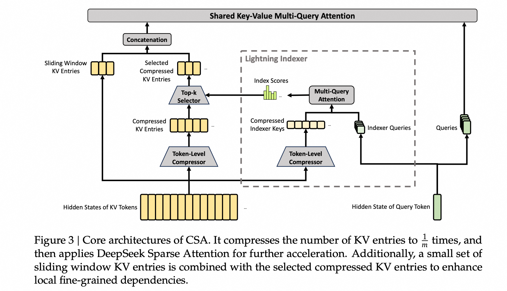

*图片来源：[DeepSeek-V4 Technical Report, Figure 3](https://huggingface.co/deepseek-ai/DeepSeek-V4-Pro/blob/main/DeepSeek_V4.pdf)*

对于 hidden states 为： $`H \in \mathbb{R}^{n \times d}`$ ， CSA 先生成两组 KV entries 和对应的压缩权重：

$$
C^a = HW_{KV}^a,\quad C^b = HW_{KV}^b
$$

$$
Z^a = HW_Z^a,\quad Z^b = HW_Z^b
$$

然后每 $m$ 个 token 压缩成一个 compressed KV entry。V4 中 CSA 的压缩率为 $m=4$。压缩本质上是对局部 token group 做带可学习 positional bias 的 softmax weighted pooling：

$$
C_i^{comp}
{}={}
\sum_{j \in \mathcal{G}_i}
\text{softmax}(Z_j + B) \odot C_j
$$

报告里的实际 CSA 使用两路 $C^a,C^b$ 和 overlap compression：每个 compressed entry 会聚合当前 group 与前一个 group 的信息。这样虽然每个 entry 来源于 $2m$ 个 KV entries，但整体序列长度仍压到约 $1/m$。

得到 compressed KV 后，CSA 不再让 query attend 到全部压缩后的历史，而是从 compressed KV 中选择 top-k entries 做 sparse attention：

$$
C_t^{sprs}
{}={}
\operatorname{TopK}(C^{comp})
$$

最终 core attention 不是 attend 到原始 $n$ 个 token，而是 attend 到 top-k 个 compressed KV。compressed KV 同时作为 key 和 value：

$$
O_t^{CSA}
{}={}
\text{Attn}(
q_t,
C_t^{sprs},
C_t^{sprs}
)
$$

V4-Pro 中 CSA 的 top-k 为 1024；V4-Flash 中为 512。两者的 CSA 压缩率都是 $m=4$。

#### HCA 的计算机制

HCA 可以理解成：

$$
\text{HCA} = \text{Heavy Compression} + \text{Dense Attention over compressed KV} + \text{local SWA branch}
$$

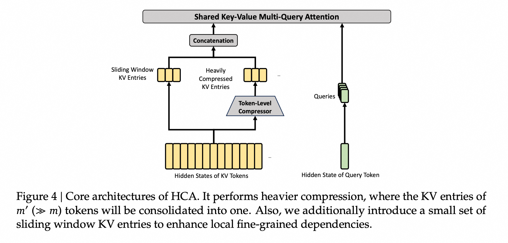

*图片来源：[DeepSeek-V4 Technical Report, Figure 4](https://huggingface.co/deepseek-ai/DeepSeek-V4-Pro/blob/main/DeepSeek_V4.pdf)*

HCA 和 CSA 的压缩形式相似，但压缩率更大，且不做 overlap compression。V4 中：

$$
m'=128
$$

每 $m'$ 个 token 被压成一个 compressed KV entry：

$$
C_i^{comp}
{}={}
\sum_{j=m'i}^{m'(i+1)-1}
\text{softmax}(Z_j + B) \odot C_j
$$

和 CSA 不同，HCA 不做 top-k sparse selection。因为序列长度已经压到约 $n/128$，它直接在重压缩后的 KV 上做 dense MQA：

$$
O_t^{HCA}
{}={}
\text{Attn}(q_t,C^{comp},C^{comp})
$$

HCA 的作用不是精确选择少量重要 block，而是用很低成本提供全局摘要信号。V4-Pro 的前两层使用 HCA，后续层交错使用 CSA/HCA；V4-Flash 的前两层是 pure SWA，后续层交错使用 CSA/HCA。

#### 为什么还需要 local SWA branch

CSA 和 HCA 都只允许 query attend 到之前的 compressed blocks。为了严格保持 causal，一个 query 不能看到自己所在压缩 block 内的其它 token；但语言模型对最近 token 的依赖又很强。

因此 V4 在 CSA/HCA 的 compressed core attention 外，额外加入一个未压缩的 sliding window branch。每个 query 还会 attend 到最近 $n_{win}$ 个原始 KV entries：

$$
O_t^{local}
{}={}
\text{Attn}(q_t,K_{t-n_{win}:t},V_{t-n_{win}:t})
$$

技术报告中的窗口大小为 $n_{win}=128$。因此 V4 的 attention 不是“只看压缩后的历史”，而是：

- 远距离上下文通过 CSA/HCA 的 compressed KV 进入模型。
- 最近上下文通过 uncompressed SWA branch 保留细粒度信息。

#### 计算缓存分析

DeepSeek-V4 的关键是把长上下文 attention 的两个维度一起压缩：

$$
n
\xrightarrow[]{\text{CSA}}
\frac{n}{m}
\xrightarrow[]{\text{top-k}}
k
$$

以及：

$$
n
\xrightarrow[]{\text{HCA}}
\frac{n}{m'}
$$

CSA 先把 KV Cache 长度压到 $1/4$，再做 top-k sparse attention；HCA 把 KV Cache 长度压到 $1/128$，因此 dense attention 也能接受。相比 V3.2 直接在原始 token 级 latent KV 上做 sparse selection，V4 同时缩小了 KV Cache 长度、indexer 搜索空间和主 attention 读取集合。

KV Cache 侧也不再是普通 `[token, head, dim]` 布局。报告中把 V4 的 cache 分成两类：

- **classical KV cache**：保存 CSA/HCA 已经压缩完成的 KV entries，包括 CSA main KV、CSA indexer KV 和 HCA KV。
- **state cache**：保存 SWA 最近窗口，以及 CSA/HCA 中还没凑满一个 compression block 的 uncompressed tail states。

这也是为什么 V4 需要专门的 heterogeneous KV cache layout：CSA/HCA 的压缩率不同，SWA 有独立 eviction policy，未压缩 tail tokens 还要等凑满 $m$ 或 $m'$ 后才能写入 compressed cache。传统 PagedAttention 假设各层 cache shape 和 policy 更统一，在这里不够直接。

低精度也是 V4 attention 成本的一部分：报告中 RoPE 维度使用 BF16，其余 KV 维度使用 FP8，lightning indexer attention 使用 FP4。以 BF16 GQA8、head dim 128 为 baseline，报告称 V4 在 1M context 下 KV Cache 可降到约 2%。

因此，DeepSeek-V4 Hybrid Attention 可以概括为：

$$
\text{DeepSeek-V4 Attention}
{}={}
\text{interleaved CSA/HCA}
+ \text{local SWA}
+ \text{shared-KV MQA}
+ \text{compressed KV cache}
$$

它不是单纯减少 head 数，也不是只做 sparse attention，而是把 **KV 表示压缩、序列长度压缩、动态稀疏选择、局部未压缩窗口和低精度 cache** 合在一起，专门面向 1M context 下的 decode 访存和 attention FLOPs。

<a id="linear-attention-gdn"></a>
### 5.4 Gated DeltaNet (GDN)

GatedDeltaNet 不是 sparse attention，也不是 MHA/GQA/MLA 这类 head layout 变体，而是 linear attention / recurrent sequence model 方向的替代结构。

标准 softmax attention 的 decode 记忆是随序列增长的 token-level KV Cache：

$$
\lbrace (k_1,v_1), (k_2,v_2), \ldots, (k_t,v_t)\rbrace
$$

GatedDeltaNet 则把历史信息写入一个矩阵状态：

$$
S_t\in\mathbb{R}^{d_v\times d_k}
$$

每一步只保留和更新这个 state，而不是为每个历史 token 保存 K/V。因此它更接近“可训练的快速权重 / associative memory”，而不是从历史 token 列表中显式检索。

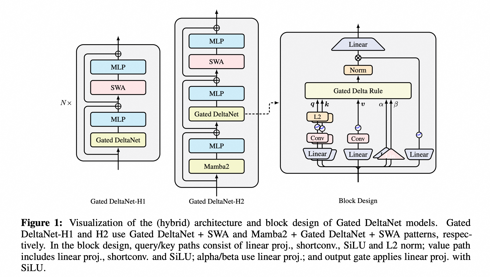

*图片来源：[Gated Delta Networks, Figure 1](https://arxiv.org/abs/2412.06464)*

#### 计算机制

最基础的 linear attention 可以利用结合律把历史 KV 写成一个 state：

$$
o_t
{}={}
\sum_{i=1}^{t} v_i(k_i^Tq_t)
{}={}
\bigl(\sum_{i=1}^{t} v_i k_i^T\bigr)q_t
$$

定义：

$$
S_t=S_{t-1}+v_tk_t^T,\qquad o_t=S_tq_t
$$

问题是，所有 key-value association 都被累加到同一个矩阵里，序列变长后容易产生 memory collision。DeltaNet 的改进是用 delta rule 对当前 key 对应的旧 value 做“擦除 + 写入”：

$$
S_t
{}={}
S_{t-1}(I-\beta_t k_tk_t^T)
+
\beta_t v_tk_t^T
$$

其中 $`\beta_t`$ 是 writing strength，$`S_{t-1}k_t`$ 可以理解为当前 state 中和 $`k_t`$ 关联的旧 value。Delta rule 先减掉旧关联，再写入新的 $`v_t`$，因此比 vanilla linear attention 的盲目累加更适合 associative recall。

GatedDeltaNet 在 delta rule 外再加一个 data-dependent decay gate：

$$
S_t
{}={}
S_{t-1}
(
\alpha_t(I-\beta_t k_tk_t^T)
)
+
\beta_t v_tk_t^T
$$

其中 $`\alpha_t\in(0,1)`$ 控制 state decay。当 $`\alpha_t\rightarrow 1`$ 时，它接近 DeltaNet，保留历史并做定向更新；当 $`\alpha_t\rightarrow 0`$ 时，旧 state 被快速衰减，模型可以清理无关记忆。也就是说，GatedDeltaNet 把 memory clearance 和 key-value association learning 放进了同一个 recurrent update。

<!-- 论文中的实际 block 还包含 Q/K/V projection、short convolution、SiLU、Q/K L2 norm、$`\alpha/\beta`$ projection 和 output gate。这些组件服务于语言建模稳定性和吞吐，不改变上面的核心递推。 -->

#### 设计动机

GatedDeltaNet 的设计动机来自三个缺口：

- Vanilla linear attention 能把 KV Cache 压成矩阵 state，但缺少删除机制，长上下文下容易 memory overload。
- Mamba2 这类 gated recurrent model 有遗忘能力，但它的 decay 更像对所有 association 做统一缩放，定向修改能力有限。
- DeltaNet 有更强的 key-value association 更新能力，但缺少快速清空无关历史的 gate。

GatedDeltaNet 的组合点正在这里：用 $`\alpha_t`$ 做 adaptive forgetting，用 $`\beta_t`$ 和 delta rule 做 targeted update。它牺牲了 softmax attention 的显式全历史检索，换来固定 state 形式的长上下文效率；所以在现代 LLM 中更常作为 softmax attention 的补充层，而不是完全替代所有 attention 层。

#### 计算缓存分析

GDN 的 decode cache 不再按 token-level KV Cache 随上下文增长：

$$
\text{KVCache}_{softmax}
\approx
2 \times B \times S \times L \times H_{kv} \times d \times b
$$

而是每层每个 recurrent head 保存一个 state。若 recurrent heads 数量为 $`H`$，state 使用的数据类型大小为 $`b_s`$ bytes，cache 规模约为：

$$
\text{Cache}_{GDN}
\approx
B \times L \times H \times d_v \times d_k \times b_s
$$

单步 decode 主要是 state update 和 state readout：

$$
S_t
\leftarrow
S_{t-1}
(
\alpha_t(I-\beta_t k_tk_t^T)
)
+
\beta_t v_tk_t^T
$$

$$
o_t=S_tq_t
$$

因此每步成本主要和 $`d_vd_k`$ 相关，而不是和历史长度 $`S`$ 相关。长上下文 decode 下，这能避免持续读取越来越大的 KV Cache，尤其适合 memory-bound 场景。

训练阶段如果逐 token 串行递推，GPU 并行度会很差。GatedDeltaNet 论文沿用并扩展 DeltaNet 的 chunkwise parallel algorithm / WY representation，把 chunk 内递推改写成矩阵乘法，让训练能使用 tensor core。

它的局限也来自同一个设计：固定大小 state 仍然可能发生 memory collision，不能无损替代 exact softmax attention；训练和推理也依赖专门的 linear/recurrent kernel。Qwen3-Next、Qwen3.5、Kimi Linear 这类模型采用的 3:1 linear/recurrent + softmax/MLA hybrid pattern，本质上就是在用 GDN 承担长期压缩记忆，用少量 softmax attention 层补足精确检索能力。

<a id="llm-attention-choices"></a>
## 6. 典型 LLM 的 Attention 选型

前面几节根据优化对象，将 attention 机制分为 KV 表示压缩和历史访问范围压缩两类。放回真实 LLM 架构里，这些机制通常不是单独出现，而是和 MoE、局部窗口、少量 full attention 层、推理系统 cache 管理一起组合。

下表主要参考 Sebastian Raschka 的 [The Big LLM Architecture Comparison](https://magazine.sebastianraschka.com/p/the-big-llm-architecture-comparison)（最后更新于 2026-04-02），并结合各模型官方发布页、模型卡和本文前面对 DeepSeek-V4 的整理。这里只关注 text LLM 的 attention 选择，不展开 MoE、Norm、Tokenizer、MTP 等其它结构差异；发布时间按首次公开发布或主要权重发布排序。

<a id="llm-attention-table"></a>
### 6.1 模型速览

| 发布月份 | 模型 / 系列 | Attention 选型 | 备注 |
| --- | --- | --- | --- |
| 2023-07 | Llama 2（7B / 13B） | MHA | 7B 为 32 Q heads / 32 KV heads，13B 为 40 Q heads / 40 KV heads；两者都是每个 query head 各自对应 KV head。 |
| 2023-08 | Qwen-7B | MHA | 第一代 Qwen 文本模型基线；该版本配置里未显式拆分 KV heads，可视作标准 MHA。 |
| 2023-09 | [Mistral 7B](https://mistral.ai/news/announcing-mistral-7b/) | GQA + SWA | 使用 GQA + SWA 用于降低长序列推理成本。 |
| 2024-05 | DeepSeek-V2 | MLA | 由 DeepSeek 引入的新的Attention机制. |
| 2024-12 / 2025-01 | DeepSeek-V3 / R1 | MLA | DeepSeek-V3 沿用并扩展 V2 的 MLA 路线；R1 基于 V3/R1 系列路线，使 MLA 更受关注。 |
| 2025-03 | Gemma 3 | GQA + SWA/full hybrid，约 5:1 | 5 个 sliding-window local layer 后接 1 个 global/full attention layer；SWA window 从 Gemma 2 的 4096 降到 1024。 |
| 2025-04 | Llama 4 | GQA | 使用 GQA，并混合 chunked/local 与 full attention 层。 |
| 2025-04 | Qwen3 dense / MoE | GQA | 官方配置中 Q heads 与 KV heads 不同，符合 GQA；可作为现代 GQA baseline。 |
| 2025-07 | Kimi K2 | MLA | 架构接近 DeepSeek-V3，但调整了 MoE 与 MLA 规模；后续 K2 Thinking 延续 K2 系列路线。 |
| 2025-08 | gpt-oss | GQA + alternating dense/local attention + attention sinks | 使用 grouped multi-query attention，并交替 dense 与 locally banded sparse attention；还加入 attention sink/bias 设计。 |
| 2025-09 | Qwen3-Next | GatedDeltaNet + Gated Attention，约 3:1 | 用 3 个 GatedDeltaNet block 搭配 1 个 gated attention block，降低长上下文 memory 成本；公开日期在不同发布源中略有差异。 |
| 2025-10 | MiniMax-M2 | GQA + full softmax attention | MiniMax-M1 曾使用 lightning attention；M2 为了 reasoning 和 multi-turn 质量回到常规 softmax attention，`sliding_window=null`，同时配置为 48 query heads / 8 KV heads 的 GQA。 |
| 2025-12 | DeepSeek-V3.2 | MLA + Sparse Attention / DSA | 在 V3 的 MLA 基础上加入稀疏 attention，面向长上下文效率。 |
| 2025-12 | Mistral Large 3 / Large 3.0 | DeepSeek-V3-like MLA | 官方命名为 Mistral Large 3；“DeepSeek-V3-like MLA”主要来自第三方架构分析口径，官方材料更强调 sparse MoE 与开放权重。 |
| 2025-12 | Xiaomi MiMo-V2-Flash | SWA/full hybrid，约 5:1，window 128 | 使用比 Gemma 3 更激进的小窗口 SWA，被文中称为当时最大规模的 SWA 模型之一。 |
| 2026-02 | Qwen3.5 | GatedDeltaNet + Softmax Attention，约 3:1 | 同Qwen3-Next |
| 2026-02 | GLM-5 | MLA + DeepSeek Sparse Attention | DeepSeekV3.2 Like的 ModelArchitecture |
| 2026-04 | Gemma 4 | 大部分变体：GQA + SWA/full hybrid，约 5:1；E2B：MQA + 4:1 | 不能把整个 Gemma 4 系列都概括为同一种 attention 配置；较大变体基本延续 Gemma 3 路线，E2B 是例外。 |
| 2026-04 | DeepSeek-V4 | CSA + HCA hybrid attention | 替代 V3/V3.2 的 MLA 路线，改为 hybrid local/long-range attention；本文前面单独展开 CSA/HCA。 |

<a id="llm-attention-trends"></a>
### 6.2 几个趋势

从 2026-05 的视角看，这些模型体现出几个趋势：

- **GQA 已经从“前沿创新”变成成熟 baseline**。Llama、Qwen3 dense/MoE、Gemma、Mistral Small、gpt-oss 等仍大量使用 GQA，因为它实现成熟、质量稳定、KV Cache 明显小于 MHA。但如果只看最新的前沿长上下文和 agent-oriented 架构，GQA 更像基础组件，而不是主要演进方向。
- **MLA 正在成为前沿大规模 MoE / long-context LLM 的核心 KV 压缩方案**。DeepSeek-V3/R1、Kimi K2、Mistral 3 Large、GLM-5 都采用或接近 DeepSeek-style MLA。相比 GQA 只减少 KV heads，MLA 直接压缩历史 K/V 表示，在长上下文 decode 中更能缓解 KV Cache 容量和 HBM 读取压力。
- **Sparse / Hybrid Attention 正在成为长上下文 agent 场景的重要路线**。DeepSeek-V3.2 的 DSA、DeepSeek-V4 的 CSA/HCA、Gemma/gpt-oss/Olmo/Xiaomi/Trinity 的 SWA/full hybrid，都说明前沿模型不再默认每层都做 full attention，而是把 full/global/local/sparse 连接组合起来，减少长上下文下实际读取和计算的 KV 数量。
- **Linear / recurrent attention 从研究路线进入主流前沿模型栈**。Qwen3-Next、Qwen3.5 类模型、Kimi Linear、Nemotron 3、MiniMax-M1 都说明，GatedDeltaNet/Mamba-style state 能把随上下文线性增长的 KV Cache 压成固定或近似固定大小的 recurrent state。它们通常不会完全替代 softmax attention，而是以 3:1、local/global、或 state-space + attention 的 hybrid pattern 出现。
- **Agent 场景正在推动 attention 从“质量优先”转向“质量 + 长上下文成本共同优化”**。多轮工具调用、代码仓库级上下文、长文档检索会把 KV Cache 容量、HBM 带宽和 prefill/decode 延迟同时放大。因此，MLA、Sparse Attention、linear/recurrent state 这些能降低长上下文 cache/访存成本的方案，正在比单纯的 GQA 更接近新一代架构主线。

下面再看另一类问题：当模型侧 attention 语义确定后，推理和训练系统如何把同样的 attention 算得更快、缓存得更省、并在多请求或多设备场景下更容易调度。

<a id="kernel-system-optimization"></a>
## 7. Kernel / 系统优化

下面这些技术经常和 attention 机制一起讨论，但它们并不直接改变模型的 attention 连接结构或 K/V 表示。它们更偏向 kernel、KV Cache 管理、prefix cache 复用、分布式执行或训练稳定性。

<a id="flashattention"></a>
### 7.1 FlashAttention：Exact Attention 的 IO 优化手段

FlashAttention 经常和 Attention 机制放在一起讨论，但它本质上不是新的 Attention 机制，也不是新的模型结构。它不改变下面这个数学结果：

$$
\text{softmax}\bigl(\frac{QK^T}{\sqrt{d}} + M\bigr)V
$$

它优化的是 exact attention 的 GPU 执行方式。核心判断是：长序列 attention 不只受 FLOPs 限制，更容易受 HBM 读写限制；因此 FlashAttention 把 $`Q,K,V`$ 分块放入 SRAM/register，用 online softmax 流式计算，避免 materialize $`S\times S`$ score/probability 矩阵。它保持 exact attention，同时显著减少 HBM read/write。

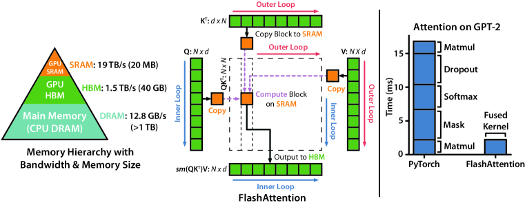

*图片来源：[FlashAttention, Figure 1](https://arxiv.org/abs/2205.14135)*


*图片来源：[Hugging Face documentation images: flash-attn.png](https://huggingface.co/datasets/huggingface/documentation-images/resolve/main/tgi/flash-attn.png)*

#### 标准实现的问题

朴素实现通常会显式 materialize attention score：

$$
QK^T \in \mathbb{R}^{S \times S}
$$

然后写入 HBM，再读回来做 softmax，再写入 attention probabilities，再读回来乘以 $`V`$。长序列下，$`S^2`$ 中间矩阵非常大，HBM 读写成为瓶颈。

#### 优化机制

FlashAttention 把 $`Q,K,V`$ 分块加载到 GPU SRAM/register，按 tile 计算局部 score，并使用 online softmax 维护每一行的归一化统计量。

对每一行 softmax，需要维护：

$$
m_i = \max_j s_{ij}
$$

$$
l_i = \sum_j \exp(s_{ij}-m_i)
$$

当新的 tile 到来时，更新 $`m_i,l_i`$，并同步更新累积输出 $`O_i`$。这样就不需要把完整 $`S \times S`$ score/probability 矩阵写回 HBM。

简化伪代码如下。这里省略 batch/head 维度，只看一个 attention head；注释中显式标出哪些变量常驻 SRAM/register：

```python
def flash_attention(Q, K, V, block_q, block_k):
    # HBM: Q, K, V, O
    O = zeros([S, d_v])

    for i in range(0, S, block_q):
        # SRAM/register: current query tile
        Qi = load_to_sram(Q[i:i + block_q])       # [block_q, d]

        # SRAM/register: online softmax state for this query tile
        mi = full([block_q], -inf)                # row-wise max
        li = zeros([block_q])                     # row-wise exp sum
        Oi = zeros([block_q, d_v])                # accumulated numerator

        for j in range(0, S, block_k):
            # SRAM/register: current key/value tile
            Kj = load_to_sram(K[j:j + block_k])   # [block_k, d]
            Vj = load_to_sram(V[j:j + block_k])   # [block_k, d_v]

            # SRAM/register: score/probability tile.
            # This tile is consumed immediately and never materialized in HBM.
            Sij = (Qi @ Kj.T) / sqrt(d)
            Sij = apply_mask(Sij, query_offset=i, key_offset=j)

            mij = rowmax(Sij)                     # SRAM/register
            mi_new = maximum(mi, mij)             # SRAM/register

            # rescale old accumulator to the new max
            Pij = exp(Sij - mi_new[:, None])      # SRAM/register
            alpha = exp(mi - mi_new)              # SRAM/register

            li_new = alpha * li + rowsum(Pij)     # SRAM/register
            Oi = alpha[:, None] * Oi + Pij @ Vj   # SRAM/register

            mi = mi_new
            li = li_new

        # HBM write: only the final output tile is written back.
        O[i:i + block_q] = Oi / li[:, None]

    return O
```

这段伪代码的关键不是少做了 $`QK^T`$，而是把完整矩阵拆成 tile 流式处理。`Qi/Kj/Vj/Sij/Pij/mi/li/Oi` 都是 tile 级别的 SRAM/register 临时状态；只有输入 `Q/K/V` 和最终输出 `O` 常驻 HBM。旧 tile 的输出会随着新的 row max 被重新缩放，因此最终结果仍然等价于 exact softmax attention。

#### 版本演进

FlashAttention 后续版本基本都没有改变“tiling + online softmax + 不物化完整 attention matrix”这条主线，主要变化是把同一个 exact attention 算法更好地映射到新 GPU 架构上。

| Version | 主要改动 | 核心目标 |
| --- | --- | --- |
| FlashAttention-1 | 提出 IO-aware exact attention：分块读取 $`Q/K/V`$，用 online softmax 流式计算输出，避免把 $`S\times S`$ score/probability 矩阵写回 HBM。 | 把 attention 从 memory-bound 的朴素实现，改成 HBM IO 更少的 fused kernel。 |
| FlashAttention-2 | 改进 work partitioning：减少 non-matmul FLOPs；把单个 head 的计算拆到更多 thread blocks，提高 occupancy；优化 warp 之间的任务划分，减少 shared memory 通信。 | 让 kernel 更接近 GEMM 效率，在 A100 等 GPU 上比 FA1 更快。 |
| FlashAttention-3 | 面向 Hopper / H100：利用 Tensor Core 与 TMA 的异步能力，使用 warp specialization 重叠数据搬运和计算；交错 matmul 与 softmax；支持更好的 FP8 low-precision attention。 | 利用 Hopper 硬件特性，提高异步流水线和低精度吞吐。 |
| FlashAttention-4 | 面向 Blackwell / B200：针对 tensor core 吞吐翻倍但 shared memory bandwidth、exp 单元等未等比例增长的非对称硬件缩放，重新设计 pipeline；使用更大的 tile、fully async MMA、软件模拟 exponential / conditional softmax rescale，并优化 backward 中的 tensor memory / 2-CTA MMA 路径。 | 把瓶颈从非 matmul 操作和 shared memory traffic 中继续挤出来，适配 Blackwell 的新性能比例。 |

FA1 到 FA4 的变化不是“attention 数学越来越不同”，而是 **同一个 exact softmax attention 在不同 GPU 代际上的系统化重排**：FA1 解决 HBM IO，FA2 解决并行度和 work partition，FA3 利用 Hopper 异步执行和 FP8，FA4 进一步针对 Blackwell 的非对称硬件瓶颈重做 pipeline。

FlashAttention 与 MHA/MQA/GQA/MLA/SWA 的关系是：它可以作为这些 attention 语义的高性能 kernel 实现。比如 GQA 改变 K/V heads 的数量，FlashAttention 改变这些张量在 GPU 上如何被读取和计算。

<a id="pagedattention"></a>
### 7.2 PagedAttention

PagedAttention 是 vLLM 提出的 KV Cache 管理机制。它不改变 attention 公式，也不减少模型逻辑上需要访问的历史 K/V；它解决的是服务系统里的 **KV Cache 分配、碎片和共享** 问题。

普通推理服务如果为每个 request 分配一段连续 KV Cache，很容易遇到两个问题：

- 不同 request 的 prompt / generation 长度不同，预留过多会浪费显存，预留过少又需要搬迁或重新分配。
- continuous batching 中 request 动态进入和退出，连续内存布局容易产生碎片。

PagedAttention 借鉴操作系统的 virtual memory / paging 思想，把每个 sequence 的逻辑 KV Cache 切成固定大小的 logical blocks，再映射到 GPU 上不连续的 physical blocks：

$$
\text{logical block id}
\rightarrow
\text{physical block id}
$$

attention kernel 不再假设某个 request 的 KV 是一整段连续内存，而是通过 block table 找到每个 token 对应的 physical KV block：

```python
for req in batch:
    q = current_query(req)
    blocks = block_table[req]          # logical -> physical blocks

    for block_id in visible_blocks(req):
        k_block, v_block = kv_pool[blocks[block_id]]
        scores = q @ k_block.T
        accumulate_attention(scores, v_block)
```

这个机制的关键是：**逻辑上连续，物理上分页**。一个 request append 新 token 时，只需要在最后一个 block 里继续写；当前 block 满了再申请新 physical block。request 结束后释放对应 block，其他 request 可以复用。

PagedAttention 的收益主要来自系统层：

- KV Cache 显存浪费接近一个 block 内的尾部碎片，而不是整段最大长度预留。
- 动态 batching 更容易做，因为 request 的 KV 可以分散在不同 physical blocks。
- beam search / parallel sampling / shared prefix 可以通过 block 级引用计数和 copy-on-write 共享前缀 KV。

它的代价也在系统层：attention kernel 需要通过 block table 间接寻址，内存访问不再是一段简单连续数组；block size 也有取舍，太大会增加尾部浪费，太小会增加 block table 和调度开销。

因此，PagedAttention 更准确地说是 **KV Cache virtual memory**，不是新的 attention 数学机制。它和 FlashAttention 可以组合：FlashAttention 负责 tile 内 exact attention 的 IO 优化，PagedAttention 负责 KV Cache 在显存中的组织和分配。

<a id="radixattention"></a>
### 7.3 RadixAttention

RadixAttention 是 SGLang 提出的 prefix KV Cache 复用机制。它同样不改变 attention 的数学公式；它解决的是另一类服务端问题：多个请求经常共享相同前缀，例如 system prompt、few-shot examples、多轮对话历史、agent tree search 中的共同路径。如果每个请求都重新 prefill 这些共享前缀，就会重复计算并重复存储 KV Cache。

RadixAttention 用 radix tree / compressed trie 管理所有已缓存的 token prefix。树上的边或节点保存一段 token 序列，value 保存对应 KV Cache 的位置：

```text
root
  └── [system prompt]
        ├── [user question A]
        └── [user question B]
```

新请求到来时，系统先做 longest-prefix match：

```python
def run_request(tokens):
    matched_kv, node = radix_cache.match_longest_prefix(tokens)
    prefix_len = len(matched_kv)

    # matched prefix already has KV cache
    suffix = tokens[prefix_len:]
    new_kv = prefill_only_suffix(suffix, prefix_kv=matched_kv)

    output = decode_with_kv(matched_kv + new_kv)
    radix_cache.insert(tokens, matched_kv + new_kv)
    return output
```

如果命中共享前缀，prefill 只需要计算 suffix；decode 时 attention 仍然看完整上下文，只是前缀部分的 KV 已经复用。请求完成后，新的 token path 会插入 radix tree；如果一个新请求只匹配到某个节点中间，radix tree 会 split node，以便后续复用更细粒度的共享前缀。

RadixAttention 的收益来自两个方面：

- **减少 prefill compute**：命中的 prefix 不需要重新跑 Transformer。
- **减少 KV Cache 存储**：共享 prefix 的 KV Cache 只存一份，通过引用计数保护，内存不足时按 LRU 等策略逐出。

这和 PagedAttention 的关注点不同。PagedAttention 管的是“一个 sequence 的 KV Cache 如何分页放进显存”；RadixAttention 管的是“多个 sequence 之间相同 prefix 的 KV Cache 如何被发现和复用”。实际系统里两者可以叠加：Radix tree 的 value 可以指向分页 KV blocks，prefix matching 可以按 page 粒度对齐，底层 attention backend 仍然可以调用 FlashAttention / FlashInfer 这类 kernel。

RadixAttention 最适合 shared-prefix workload：长 system prompt、retrieval-augmented QA、few-shot prompting、多轮 chat、tree-of-thought / agent 分支搜索。它不减少单个全新请求的 attention 计算；如果请求之间几乎没有共享前缀，收益也会明显下降。

<a id="ring-attention"></a>
### 7.4 Ring Attention

Ring Attention 是长上下文训练中的分布式 exact attention 执行方式。它不改变 attention 公式，也不稀疏化连接；它解决的是单卡放不下长序列时，如何把 sequence 维度切到多张 GPU 上，并且让通信和计算重叠。

假设把长度为 $`S`$ 的序列切到 $`P`$ 张 GPU 上，每张 GPU 持有一段本地 query block：

$$
Q^{(p)},K^{(p)},V^{(p)},\quad p=0,\ldots,P-1
$$

每张 GPU 要计算本地 query 对全局 K/V 的 attention。朴素做法需要 all-gather 全部 K/V，这会让每张卡重新持有完整序列，显存压力仍然很大。Ring Attention 的做法是让 K/V block 沿 ring 拓扑逐步传递：

```python
for step in range(num_devices):
    # local GPU owns Q_local and one K/V block at a time
    scores = Q_local @ K_block.T
    update_online_softmax(scores, V_block)

    # send current K/V block to next GPU, receive previous GPU's block
    K_block, V_block = ring_send_recv(K_block, V_block)
```

每张 GPU 在任意时刻只需要保存本地 Q block、本地/当前传入的 K/V block，以及 online softmax accumulator。经过 $`P`$ 轮之后，本地 query 已经看过所有设备上的 K/V，得到的结果仍然等价于 full attention。

它和 FlashAttention 的关系很紧：FlashAttention 是单卡或单设备内的 tile-level IO 优化；Ring Attention 是多设备 sequence parallel 的调度方式。实际实现中，Ring Attention 通常也会在每个本地 block 上使用 FlashAttention-like online softmax，并把下一块 K/V 的通信隐藏在当前 block 的 attention 计算后面。

Ring Attention 的收益和代价都很明确：

- 收益：单卡不需要保存完整序列的 K/V 和 attention 中间结果，context length 可以随设备数扩展。
- 收益：保持 exact attention，不改变模型训练目标。
- 代价：每层 attention 都需要环形通信，性能取决于 interconnect 带宽和通信计算重叠程度。
- 代价：它主要解决训练 / long-context prefill 的分布式显存问题，不是单机 decode KV Cache 压缩机制。

因此，Ring Attention 更准确地说是 **sequence parallel attention runtime**，而不是新的 Attention 结构。

<a id="flexattention"></a>
### 7.5 FlexAttention

FlexAttention 是 PyTorch 提供的可编程 attention kernel 接口，API 位于 `torch.nn.attention.flex_attention`。它不是新的 attention 数学机制，而是一个 **compiler-driven programming model**：用户用少量 Python 函数描述 attention score 如何修改、哪些位置需要参与计算，`torch.compile` 再把这些逻辑 lowering 成 fused attention kernel。

它要解决的问题是：FlashAttention 这类 fused kernel 很快，但通常比较“单体化”。如果研究者想组合 causal mask、sliding window、ALiBi、relative bias、document mask、tanh soft-capping、sample packing、PagedAttention 等变体，经常需要等待已有 kernel 支持，或者自己写 Triton/CUDA。FlexAttention 的目标是把这类变体变成 Python 级别的可组合描述，同时尽量保留 FlashAttention-style kernel 的性能。

#### 计算接口

FlexAttention 的核心调用形式可以简化为：

```python
from torch.nn.attention.flex_attention import flex_attention

out = flex_attention(
    query,
    key,
    value,
    score_mod=score_mod,
    block_mask=block_mask,
    enable_gqa=True,
)
```

其中 `score_mod` 描述 **softmax 前的 score 如何被修改**。它接收当前 scalar score，以及 batch/head/query/key-value index：

```python
def score_mod(score, b, h, q_idx, kv_idx):
    return score
```

例如 ALiBi / relative position bias / local boost / soft-capping 都可以写成 score-level 变换，而不需要显式 materialize 一个 $`S\times S`$ bias matrix：

```python
def alibi(score, b, h, q_idx, kv_idx):
    distance = q_idx - kv_idx
    return score + slopes[h] * distance
```

`mask_mod` 则描述 **哪些 query-key 位置需要参与计算**：

```python
def causal_window(b, h, q_idx, kv_idx):
    causal = q_idx >= kv_idx
    window = q_idx - kv_idx <= W
    return causal & window
```

然后通过 `create_block_mask` 把 token-level mask 转成 block-level sparsity metadata：

```python
from torch.nn.attention.flex_attention import create_block_mask

block_mask = create_block_mask(
    causal_window,
    B=None,
    H=None,
    Q_LEN=S,
    KV_LEN=S,
)

out = flex_attention(q, k, v, block_mask=block_mask)
```

这里区分 `score_mod` 和 `mask_mod` 很关键：`score_mod` 更通用，但如果只是 mask，把无效位置写成 `-inf` 仍然可能让 kernel 走过这些位置；`block_mask` 能让 kernel 在 block 粒度上跳过无效区域，从而利用稀疏性。

#### 设计动机

FlexAttention 的价值不是“比 FlashAttention 更 exact”，而是让更多 attention 变体不用手写 kernel：

- **可表达性**：用 `score_mod` 表达 bias、相对位置、soft-capping、attention sink 等 score-level 逻辑。
- **稀疏性**：用 `mask_mod + create_block_mask` 表达 causal、sliding window、document mask、sample packing 等 block sparse pattern。
- **可组合性**：多个 mask 可以组合，score modification 和 block mask 也可以同时使用。
- **自动反向**：PyTorch 编译和 autograd 体系会生成对应 backward，而不是只支持 forward。

从工程视角看，FlexAttention 相当于把“attention variant 的语义描述”和“底层 fused kernel 实现”分离。研究阶段可以用 Python 表达新 pattern；当形状和 pattern 稳定后，`torch.compile` 为该组合生成专门 kernel。

#### 推理与后端

PyTorch 后续还为 FlexAttention 加了推理侧路径。长上下文 decode 的形态通常是：

$$
q\_len \ll kv\_len
$$

例如每步只有 1 个新 query token，但要 attend 到很长的 KV Cache。PyTorch 的 FlexDecoding backend 会在这种短 query / 长 KV 的形态下，生成更适合 decode 的 fused kernel，而不是沿用更偏 prefill/training 的 square attention kernel。官方介绍中还提到推理路径支持 GQA，并能和 PagedAttention 这类 KV Cache 管理方式配合。

到 2026 年，FlexAttention 还开始接入 FlashAttention-4 backend：用户仍然写 `score_mod` / `mask_mod`，但底层可以选择 FA4 风格后端，在 Hopper / Blackwell 上改善高性能场景的吞吐。这说明 FlexAttention 的定位不是替代 FlashAttention，而是把 FlashAttention-style kernel 变成更可编程的后端。

#### 适用边界

FlexAttention 适合：

- 快速实验自定义 attention 变体。
- 组合多个 score bias / mask pattern。
- 希望保持 fused kernel，而不想手写 Triton/CUDA。
- 训练和 prefill 中的 block sparse / custom mask attention。

它的边界也很清楚：

- 不是所有动态 top-k / gather 型稀疏 attention 都能自然表达成静态 `BlockMask`。
- `torch.compile` 会带来编译开销；shape 或 pattern 大幅变化时可能触发重新编译。
- 通用可编程接口通常很难永远追平为单一 pattern 手写到极致的 kernel；FA4 backend 正是在缩小这个差距。

所以，FlexAttention 更准确地说是 **attention kernel programming interface**：它把 FlashAttention 的 IO-aware 执行思想扩展到“可组合 attention 变体”的场景。


<a id="references"></a>
## 8. References

- [Attention Is All You Need](https://arxiv.org/abs/1706.03762)
- [The Big LLM Architecture Comparison](https://magazine.sebastianraschka.com/p/the-big-llm-architecture-comparison)
- [OLMo 2: The best fully open language model to date](https://allenai.org/blog/olmo2)
- [Gemma 3: Google’s new open model based on Gemini 2.0](https://blog.google/technology/developers/gemma-3/)
- [Mistral Small 3.1](https://mistral.ai/news/mistral-small-3-1)
- [Welcome Llama 4 on Hugging Face](https://huggingface.co/blog/llama4-release)
- [Qwen Architecture Evolution](https://qwen.moe/)
- [Qwen3: Think Deeper, Act Faster](https://qwenlm.github.io/blog/qwen3/)
- [Qwen3-Next in Transformers](https://huggingface.co/docs/transformers/model_doc/qwen3_next)
- [Qwen3-Coder-Next-Base](https://huggingface.co/Qwen/Qwen3-Coder-Next-Base)
- [Moonshot releases Kimi K2](https://www.cnbc.com/2025/07/14/alibaba-backed-moonshot-releases-kimi-k2-ai-rivaling-chatgpt-claude.html)
- [Introducing gpt-oss](https://openai.com/index/introducing-gpt-oss)
- [MiniMax M2 & Agent](https://www.minimax.io/news/minimax-m2)
- [Why Did MiniMax M2 End Up as a Full Attention Model?](https://platform.minimax.io/docs/guides/text-m2-full-attention)
- [Kimi Linear: An Expressive, Efficient Attention Architecture](https://arxiv.org/abs/2510.26692)
- [DeepSeek Transparency Center](https://www.deepseek.com/en/transparency/)
- [Fast Transformer Decoding: One Write-Head is All You Need](https://arxiv.org/abs/1911.02150)
- [GQA: Training Generalized Multi-Query Transformer Models from Multi-Head Checkpoints](https://arxiv.org/abs/2305.13245)
- [DeepSeek-V2: A Strong, Economical, and Efficient Mixture-of-Experts Language Model](https://arxiv.org/abs/2405.04434)
- [DeepSeek-V3 Technical Report](https://arxiv.org/abs/2412.19437)
- [DeepSeek-V3 671B config](https://github.com/deepseek-ai/DeepSeek-V3/blob/main/inference/configs/config_671B.json)
- [DeepSeek-V3 inference model.py](https://raw.githubusercontent.com/deepseek-ai/DeepSeek-V3/main/inference/model.py)
- [Mistral 7B](https://arxiv.org/abs/2310.06825)
- [FlashAttention: Fast and Memory-Efficient Exact Attention with IO-Awareness](https://arxiv.org/abs/2205.14135)
- [FlashAttention-2: Faster Attention with Better Parallelism and Work Partitioning](https://arxiv.org/abs/2307.08691)
- [FlashAttention-3: Fast and Accurate Attention with Asynchrony and Low-precision](https://arxiv.org/abs/2407.08608)
- [FlashAttention-4: Algorithm and Kernel Pipelining Co-Design for Asymmetric Hardware Scaling](https://arxiv.org/abs/2603.05451)
- [torch.nn.attention.flex_attention documentation](https://docs.pytorch.org/docs/2.11/nn.attention.flex_attention.html)
- [FlexAttention: The Flexibility of PyTorch with the Performance of FlashAttention](https://pytorch.org/blog/flexattention/)
- [FlexAttention: A Programming Model for Generating Optimized Attention Kernels](https://arxiv.org/abs/2412.05496)
- [FlexAttention Part II: FlexAttention for Inference](https://pytorch.org/blog/flexattention-for-inference/)
- [FlexAttention + FlashAttention-4: Fast and Flexible](https://pytorch.org/blog/flexattention-flashattention-4-fast-and-flexible/)
- [Efficient Memory Management for Large Language Model Serving with PagedAttention](https://arxiv.org/abs/2309.06180)
- [Efficiently Programming Large Language Models using SGLang](https://arxiv.org/abs/2312.07104)
- [SGLang RadixAttention Docs](https://sgl-project-sglang-93.mintlify.app/concepts/radix-attention)
- [Ring Attention with Blockwise Transformers for Near-Infinite Context](https://arxiv.org/abs/2310.01889)
- [DeepSeek-V3.2: Pushing the Frontier of Open Large Language Models](https://arxiv.org/abs/2512.02556)
- [DeepSeek-V3.2-Exp 发布，训练推理提效，API 同步降价](https://api-docs.deepseek.com/zh-cn/news/news250929)
- [DeepSeek-V4 Technical Report](https://huggingface.co/deepseek-ai/DeepSeek-V4-Pro/blob/main/DeepSeek_V4.pdf)
- [DeepSeek V4 in vLLM: Efficient Long-context Attention](https://vllm.ai/blog/deepseek-v4)
- [Gated Delta Networks: Improving Mamba2 with Delta Rule](https://arxiv.org/abs/2412.06464)
- [DeltaNet Explained (Part I): The Model](https://sustcsonglin.github.io/blog/2024/deltanet-1/)
