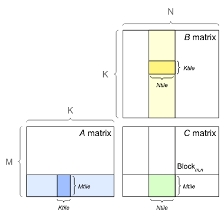
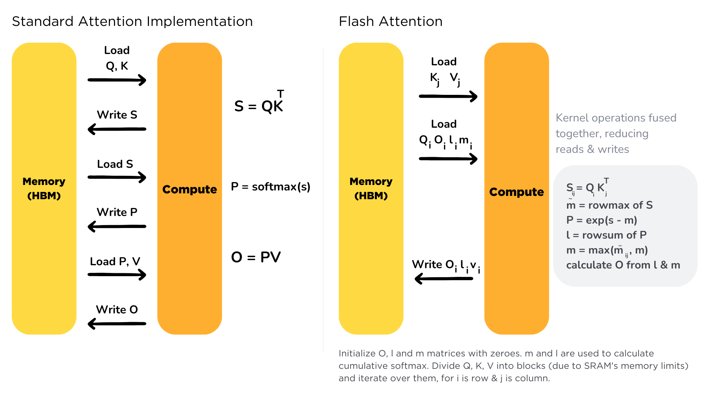
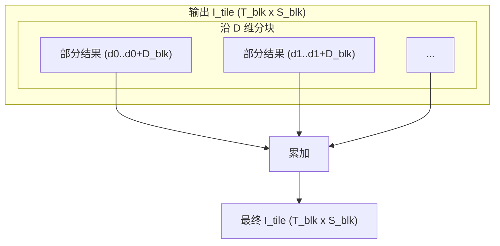

# Attention

## Attention Mechanism

$$
Attention(Q, K, V) = softmax(\frac{QK^T}{\sqrt{d_k}})V
$$

$$
Q \in \mathbb{R}^{T \times D}
$$

$$
K^T \in \mathbb{R}^{D \times S}
$$

$$
V \in \mathbb{R}^{S \times D}
$$

$$
O \in \mathbb{R}^{T \times D}
$$


## FlashAttention

## Tile in GEMM




```python

for m in range(0, M, M_blk):
    for n in range(0, N, N_blk):
		C_tile = initialize_zero(C_tile)
        for k in range(0, K, K_blk):
            A_tile = A[m:m+M_blk, k:k+K_blk]
            B_tile = B[k:k+K_blk, n:n+N_blk]
            C_tile = C[m:m+M_blk, n:n+N_blk]
            C_tile += A_tile @ B_tile

```


## Flash Attention




## Question:


- 启动的Kernel情况?


- How does KV Cache works？





## References:

- [Matrix Multiplication Background User's Guide](https://docs.nvidia.com/deeplearning/performance/dl-performance-matrix-multiplication/index.html)