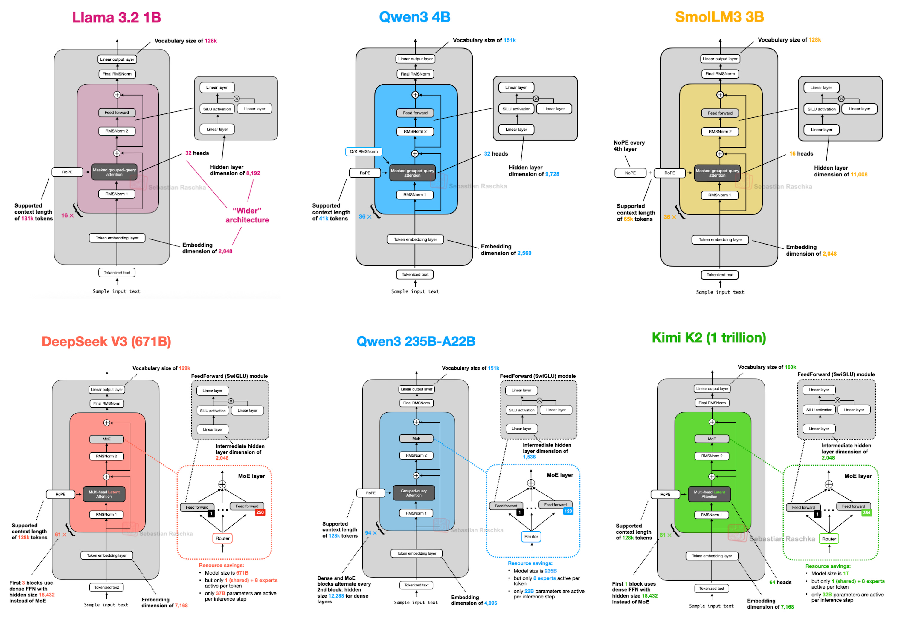
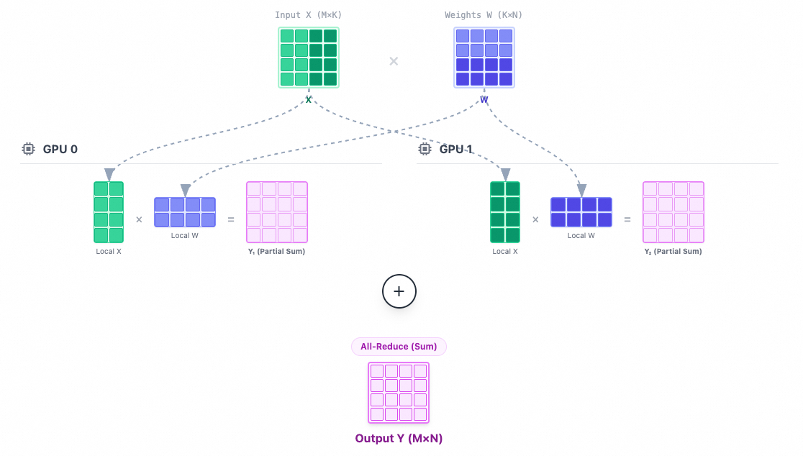
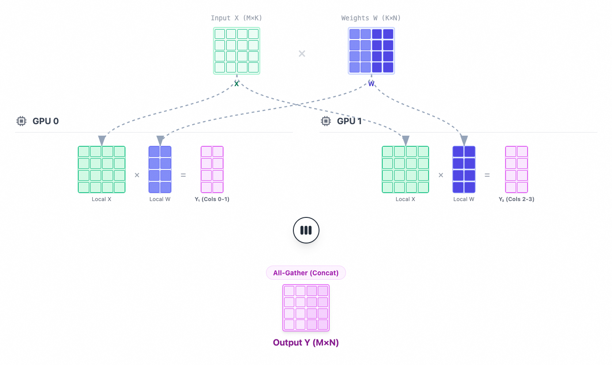
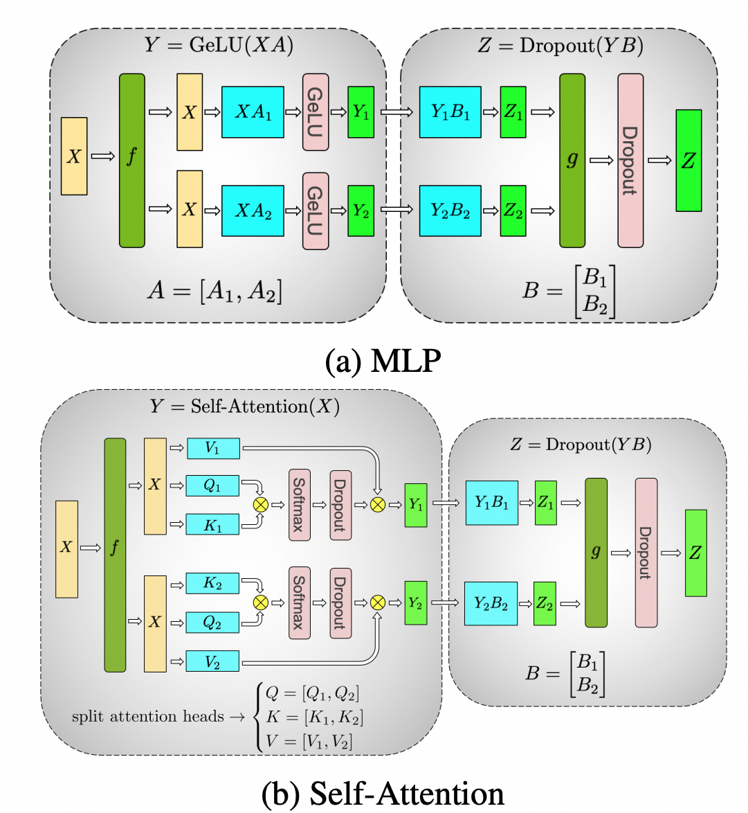

# Mini-SGlang Walkthrough

Mini-SGlang是SGlang的简版实现，基本覆盖了高性能LLM推理系统的主要模块，包括`KVCache/RadixAttention`，`Continous Batching`，`TensorParallel`，`Overlap Scheduling`，`高性能Kernel`， `CUDA Graphs`等主要特性。

## Decoder-Only Transformer的特性

目前主流LLM都是基于Decoder-Only Transformer，或者在Attention Layer上做改造，引入MQA，GQA，MLA等不同的attention机制，或者在FFN层引入MoE/Gate等，整体架构上还是基于Decoder-Only Transformer。

基于Decoder-Only的LLM的训练阶段，模型的输入是 token ids($X \in \mathbb{R}^{B \times S}$, $S$为序列长度，$B$为batch size，单样本输入），输出对每个token位置上下一个token的logits( $y_t \in \mathbb{R}^{B \times S \times V}$ , $V$为vocab size），基于交叉熵获取序列上每一个token预测的loss，从而使得模型学会如何预测下一个token。

而在推理（Inference）阶段，模型需要基于当前的输入序列，逐 token 地完成自回归（Autoregressive）生成。每一轮，将序列输入模型后，获取输出的最后一个 token 的 logits 用于采样；采样得到新的 token 后，将其追加（append）到输入序列的末尾，再送入模型进行下一轮推理，直至生成结束 token。

### KVCache 为何能够复用？

Decoder-Only Transformer的模型推理流程可见下图，

分析模型的 forward 流程可以发现：在 LLM 的 forward 计算中，包括 Q/K/V、Attention Score、Attention Output 以及 Hidden States 在内的各个网络层输出，在每一轮 token 的推理中都呈现出 **“增量追加”** 的更新形态。

在自回归解码的第(t)轮推理中，序列长度从(t-1)增加到(t)：我们在历史 tokens 后追加了一个新 token。从数学角度来看，隐藏表示（Hidden States）等中间输出，也是从序列长度
(t-1)增加到(t)，仅仅是多出了新 token 位置的向量表示，历史 tokens 的向量表示并未改变。

这个现象可以从LLM算子的特性来理解：

1. **绝大多数子层是Token-wise（逐词）计算**

诸如 Embedding、LM Head、LayerNorm 以及 MLP（Gate/Up/Down）等组件，在每个位置$i$上都是对该位置的隐藏状态$h_i$进行独立变换（如线性投影、归一化、逐元素非线性激活等）。因此，当输入序列发生增量变化时，新增的 token 不会影响历史 token 的输出计算。

PositionEmbedding/RoPE则是根据当前token的位置信息增加state，新增token不会影响历史token的计算。

1. **在 Causal Mask 的自注意力中：新 token 不会影响历史 token 的 Attention Output**

带有 Causal Mask 的 Scaled Dot-Product Attention 计算公式为：

$$
{Attn}(Q,K,V)=\text{softmax}\Big(\frac{QK^\top}{\sqrt{d_k}} + M\Big)V,
$$

当我们把序列长度从 $t-1$ 追加到 $t$ 时，将 Query、Key、Value 按照“历史 vs 新 token”进行分块。我们令注意力权重矩阵 $A = \text{softmax}(\frac{QK^\top}{\sqrt{d_k}} + M)$，则 $A$ 可以写成 2×2 的分块矩阵：

$$A = \begin{bmatrix} A_{\text{hist}\to\text{hist}} & A_{\text{hist}\to\text{new}}\\ A_{\text{new}\to\text{hist}} & A_{\text{new}\to\text{new}} \end{bmatrix} $$

分别表示历史对历史，历史对新增token，新增token对历史，新增token对新增token的Attention Score。

在 Causal Mask ($M$) 的作用下，模型被禁止“历史 Query 看到未来 Key”。这意味着矩阵右上角的区域（历史对新增token的attention）会被 Mask 为负无穷，经过 Softmax 后，$A_{\text{hist}\to\text{new}}$ 将变成全 0 权重矩阵。

$$A = \begin{bmatrix} A_{\text{hist}\to\text{hist}} & 0 \\ A_{\text{new}\to\text{hist}} & A_{\text{new}\to\text{new}} \end{bmatrix} $$

因此，我们仅需计算Attention Score这一轮新增的 $A_{new}=\begin{bmatrix}A_{new \to hist} &  A_{new \to new}\end{bmatrix}$，同时因为
 $$A_{\text{new}} = \text{softmax}(Q_{\text{new}} \cdot [K_{\text{hist}}, K_{\text{new}}]^\top)$$

我们仅需当前token的Q和完整的K即可获取新增的Attention Score，不会有历史的Q参与Attention Score的计算，也就不会有所谓的Q Cache。

获得的AttentionScore与V相乘即可获得Attention Output。 基于矩阵分块，我们可以获得历史AttentionOutput是由历史的Attention Score与所有的V相乘得到:

$$
O_{\text{hist}}^{(t)}
=
\begin{bmatrix}
A_{\text{hist}\to\text{hist}} & 0
\end{bmatrix}
\times
\begin{bmatrix}
V_{\text{hist}} \\ V_{\text{new}}
\end{bmatrix}
=
A_{\text{hist}\to\text{hist}} V_{\text{hist}}
$$

因为$A_{hist\to new}$为全0，因而(t)轮次的历史的Attention Output是不变的，他的完整的Attention输出也仅是Append上新的token的Attention Output。

这正是 KV Cache 得以复用的理论基础。在计算第 $t$ 轮的 Attention Output 时，我们需要所有token对应的K和V，因为K/V同样也是逐token得方式进行更新，因而我们可以复用上一轮的K/V，Append上新的token输入引入的额外的K/V,$k_t$ 和 $v_t$，即可获得完整的这一轮所需的K/V，完成这一轮AttentionOutput的计算，从而极大得节省了算力。

### Prefill vs Decode

基于以上的分析，我们也可以发现，每当我们做一轮新的token推理时，除了Attention Layer之外，是不需要关注历史的token信息的。而Attention Layer对于历史信息的使用，也可以基于K/V Cache获得。

当一个新的序列输入，在第一次推理next token时，K/V cache是不存在的，因而需要基于完整的序列的输入，计算获得完整的序列对应的K和V，这个过程称为Prefill。

而在下一轮推理中，则可以复用历史/上一轮已经获取的K/V，仅需计算当前轮次的$k_t$,和$v_t$，然后Append到历史的K/V中，参与Attention的计算，这个过程称为Decode。

## Continuous Batching

## KVCache Manager

## 服务架构

启动服务后，会启动4组进程，服务之间通过ZMQ进行通讯

- API Server

提供OpenAI Compatible Server的HTTP 服务，将请求发送给到Tokenizer worker，然后持续接收detokenizer worker生成的输出文本chunk，返回给到客户端。

- Tokenizer worker

负责message到token_ids, 对于OpenAI Message List，先通过chat_template进行转换。

- Scheduler worker

核心推理模块，负责LLM推理循环，接受Tokenizer worker发送过来的请求，完成模型forward推理，返回token ids给到Detokenizer worker。

- Detokenizer worker

负责接受scheduler的输出token ids，转换为字符串并返回给API Server。

## Decoder Transformer 的特性

目前的LLM主要还是Decoder Only Transformer架构，高性能推理框架也围绕Decoder Transformer的特性(特别是Casual Masked Attention）进行优化。

*references*：[Big Model Architectur](https://magazine.sebastianraschka.com/p/the-big-llm-architecture-comparison)

| Feature                  | Kimi K2.5                                   | DeepSeek V3                             | Qwen3 (MoE/235B-A22B)                                | Gemma 3（按 ≥4B 与 1B 区分）              | **GPT OSS（20B / 120B）**                                                                                                           | Llama 3（8B/70B）                 |
| ------------------------ | ------------------------------------------- | --------------------------------------- | ---------------------------------------------------- | ----------------------------------- | --------------------------------------------------------------------------------------------------------------------------------- | ------------------------------- |
| Core Arch                | Decoder-only Transformer + MoE              | Decoder-only Transformer + MoE          | Decoder-only Transformer + MoE                       | Decoder-only Transformer（Dense）     | **Decoder-only Transformer + MoE（routed experts）**                                                                  | Decoder-only Transformer（Dense） |
| Attention Mechanism      | **MLA**                                     | **MLA**                                 | **GQA**                                              | **局部滑窗注意力 + 交错全局层**；并用 **GQA**      | **GQA（64 query heads + 8 KV heads）+ 交替 Dense / Banded（window=128）**                                                               | **GQA**                         |
| Sliding / Global Pattern | （未按滑窗主打）                                    | （未按滑窗主打）                                | （未按滑窗主打）                                             | **5 个局部层 : 1 个全局层**（交错）             | **Attention 层交替：全上下文 dense ↔ 带状/滑窗 banded（带宽 128 tokens）**                                                                        | 无（标准全注意力）                       |
| MoE Strategy             | DeepSeek-V3 风格 MoE（含 shared expert）         | DeepSeekMoE（含 shared expert）            | **Fine-grained MoE（无 shared）**                       | Dense                               | **Top-k 路由：每 token 选 Top-4 experts；专家数 20B=32、120B=128（官方描述）**                                                                    | Dense                           |
| Norm & Stabilization     | RMSNorm（Pre-Norm）                           | RMSNorm                                 | QK-Norm + RMSNorm（在注意力中做 QK 归一）                      | **Dual RMSNorm（Pre+Post）+ QK-Norm** | **RMSNorm + Pre-LN（注意力与 MoE 前做 RMSNorm）**                                                                                         | RMSNorm（Pre-Norm）               |
| Positional Embedding     | RoPE                                        | RoPE                                    | RoPE                                                 | RoPE                                | **RoPE + YaRN（把 dense 注意力上下文扩到 131,072）**                                                                                         | RoPE                            |
| FFN Activation           | SwiGLU                                      | SwiGLU                                  | SwiGLU                                               | GeGLU / SwiGLU（按实现/变体）              | **SwiGLU（官方注明实现带 clamping + residual 等“非典型”细节）**                                                                                  | SwiGLU                          |
| Context Window（原生）       | **256k**                                    | **128k**                                | **32k**                                              | **≥4B：128k；1B：32k**                 | **131,072（≈131k）**                                                                                                                | **8k**                          |
| Context Extension        | （已原生 256k）                                  | （已到 128k）                               | **YaRN：可到 131k（≈128k）**                              | （官方即给 32k/128k）                     | **YaRN：从 original_max_position_embeddings=4096 扩到 131,072（配置与官方一致）**                                          | （3.1 才到 128k）                   |
| Key Differentiator       | **原生多模态 MoE**：视觉编码器注入；高 expert 数（384）+ 256k | **MLA + shared expert**：高效率、训练/推理稳定性与吞吐 | **Deep & Narrow MoE**：A22B 激活参数、无 shared、可 YaRN 长上下文 | **“局部滑窗 + 交错全局”**：长上下文计算更省          | **OpenAI 开源权重 MoE + 交替 dense/banded 注意力 + GQA（group size=8 KV）+ 131k 长上下文；并引入 attention head 的 learned bias（分母偏置）** | **稳健基线**：经典 dense + GQA         |

*reference*: ChatGPT && Gemini

在Transformer架构中，参数主要集中在Attention/FFN layer中

- Attention 层 (约为 1/3)

Attention 包含四个主要的权重矩阵：$W_Q, W_K, W_V$（用于生成 Query, Key, Value）和 $W_O$（用于输出投影）。通常这 4 个矩阵的形状都是 $d_{model} \times d_{model}$。

参数量 $\approx 4 \times d_{model}^2$。

- FFN 层 (约为 2/3)

FFN 通常会先把维度放大（例如放大 4 倍），经过激活函数后再缩回原维度。上投影矩阵 ($d \to 4d$) 和 下投影矩阵 ($4d \to d$)。参数量 $\approx 2 \times (d_{model} \times 4d_{model}) = 8 \times d_{model}^2$。

基于SwiGLU的使用了3个投影矩阵（Gate，Up，Down），通常会将中间维度从 $4d$ 调整为 $\frac{8}{3}d$ 左右。计算结果依然接近：$3 \times (d_{model} \times \frac{8}{3}d_{model}) \approx 8 \times d_{model}^2$。

所以通常有如下的参数量比例:

$$\text{Attention} : \text{FFN} \approx 4d^2 : 8d^2 = 1 : 2$$

在序列参数为$N$，因为Attention Score的计算涉及一个$N \times N$的矩阵乘法，他的计算复杂度为$O(N^2)$，而MLP的计算复杂度为$O(N)$。

因而在序列很短的情况下，可以认为二者的计算FLOPS与参数量成正比，而随着序列长度的增加，Attention的计算量则会超过FFN的计算量。在各种LLM的推理优化手段，也主要围绕Attention Layer进行。

### Decoder Only LLM的推理过程

LLM 的 next-token 训练中，输入是 token ids，模型输出对每个token位置上，下一个token的logits( $y_t$ )，用位置 $t$ 的输出去预测目标 token $t+1$，通过这种方式学会预测下一个token。

在推理时，我们需要逐token的进行预测，预测next token，然后将新生成的token append到输入中，继续预测下一个token，直到遇到结束token为止。与训练不同，这个过程中，我们并不需要获取每一个位置的`next_token_logits`，仅需要新输入token对应的`next token logits`。

在整个计算过程中，除了Attention Layer，其他的Layer，例如embedding、LLM Head、FFN、LayerNorm等，都是token-wise的算子，是针对于一个token的state的projection/norm等操作，是与对应的token的上下文/位置是无关的。

Decoder Transformer的Attention Layer，会基于一个Causal Masked的Attention Score矩阵，只允许当前位置的token看到前面的token，而看不到后面的token，这个特点使得在自回归的推理过程中，可以复用上一轮的K/V，使用空间换时间的方式进行优化。

## Continous Batching

## TensorParallel的执行流程

考虑一个 $Y=X \times W $ 的矩阵乘( $W \in \mathbb{R}^{a \times c}$ )，其中 $X \in \mathbb{R}^{a \times b}$， $Y \in \mathbb{R}^{b \times c}$。

在TP执行时，可以采用对 $W$ 的不同纬度上进行切分。

- Row Parallel

Row Parallel 是对 $W$ 的第一维(Row方向)进行切分策略。采用这个策略时，$X$ 也同样会进行切分。假设TP=2，切分后的两个矩阵变为 $X=\begin{bmatrix} X_1 & X_2 \end{bmatrix}$ 和 $W=\begin{bmatrix} W_1 \\ W_2 \end{bmatrix}$。两个GPU分别计算 $Y_1=X_1 \times W_1$ 和 $Y_2=X_2 \times W_2$，最终结果需要一次All Reduce (Sum) 操作进行合并， $Y=Y_1 + Y_2$。

- Column Parallel

Column Parallel 是对 W 的第二维(Column方向)进行切分策略。采用这个策略时，$X$ 不进行切分, $W$ 则被切分为 $W=\begin{bmatrix} W_1 & W_2 \end{bmatrix}$。两个GPU分别计算, $Y_1=X \times W_1$ 和 $Y_2=X \times W_2$，最后的结果需要一个Concat操作进行合并， $Y=\begin{bmatrix} Y_1 & Y_2 \end{bmatrix}$。

通过TP可以将权重切分到不同的GPU上，降低显存压力，并且通过多GPU提高计算速度，不依赖于较大的Batch来打满GPU。

因而它主要适用于模型较大(需要切分weight）/单次GEMM计算量较大(重复使用多GPU/提高计算速度）/batch较小的场景(并没有大Batch来打满GPU）。

因为通讯带宽/延迟要求高，TensorParallel通常是跑在单节点上，依赖卡间的高速NVLink。

- Indexing Layer 的TP策略

根据TP size，以vocab_size纬度进行切分，然后不同的Rank各自完成Embedding的查找。如果当前的Rank的Embedding没有命中，则直接将Embedding置为0。

每一个Token只能够在一个GPU上找到自己的Embedding，其他都为0，因而最后可以通过一次all reduce操作完成Embedding的合并。

- Transformer Block的TP策略

一个标准的Transformer block可以抽象为以下的计算流程：

$$
X \xrightarrow[]{\text{QKV}} Q,K,V \xrightarrow[]{\text{Attention}} O \xrightarrow[]{W_o} Y \xrightarrow[]{\text{FFN}} Z
$$

- Attention Layer 的策略

QKV 投影($W_Q, W_K, W_V$) 采用 Column Parallel， 而Attention Layer输出($W_O$) 采用 Row Parallel。

QKV的投影计算通常是基于一个大的矩阵乘法完成，如下：

$$
[Q,K,V] = XW_{qkv}, \quad W_{qkv}\in\mathbb{R}^{H\times 3H}
$$

multi_head_attention的计算流程中，不同Head的Projection/Attention的计算也是天然可以切分到不同的卡上，也是可以直接可以基于ColumnParallel完成。$W_{qkv}$ 可以被切分为 $p$ 个部分，每个部分的大小为 $\frac{3H}{p}$。然后各自在不同的卡上，完成各自的Attention的计算。

$$
W_{qkv}=
\begin{bmatrix}
W_{qkv}^{(1)} & W_{qkv}^{(2)} & \cdots & W_{qkv}^{(p)}
\end{bmatrix},
\quad
W_{qkv}^{(i)}\in\mathbb{R}^{H\times \frac{3H}{p}}
$$

$$
O_i = \text{Attention}(Q_i,K_i,V_i)
$$

- Attention Output projection：Row Parallel
- FFN Layer
  - FFN Up projection：Column Parallel
  - FFN Down projection：Row Parallel

基于这个策略，仅需两次的ALl Reduce (分别发生在Attention Layer和FFN Layer) 操作即可完成整个Transformer Block的计算。

- Embedding Layer

- Transformer-Block.Attention Layer

MultiHeadAttention的计算流程中，不同Head的Q/K/V Projection，天然就是Column Parallel，不同的GPU上完成各自的不同的Head Attention的计算。

Attention的Output Projection采用Row Parallel，各自Head Attention的输出和 $W_O$ Projection 的输入一样，是分片到不同的GPU上。

- Transformer-Block.FFN Layer

Column Parall

Row Parallel 获取的数据并不能使用，需要一次All Reduce？ Column Parallel完成后每一个GPU上获取的是

## Overlap Scheduling

## CUDAGraph support

## Custom Kernel

- pynccl

## Questions

- LLM Inference Server的架构

- 什么是multi token prediction

- Overlap Scheduling是啥

- 如何做的Distribute Serving?

- CUDA Graphs 如何集成?

- KVCache 如何管理？

- Prefill vs Decode

- why pynccl?

overhead of pytorch distirbuted? 如何体现出来呢?

- 具体的kernel实现

- 显存管理:

主要哪些模块使用了显存，使用了多少的显存

- nccl 通讯中是否需要使用到显存

- nvShmem vs nccl

前者直接通过kernel中进行

- 具体的Kernel算子 in mini-sglang

- TP 是如何执行的

模型切分， 为什么QKV的projecton/FFN的第一次projection是Row Parallel的，而Attention/FFN的第二次投影是采用Column Parallel的？

考虑一个 $Y=X \times W $ 的矩阵乘( $W \in \mathbb{R}^{W \times Y}$ )，其中 $X \in \mathbb{R}^{X \times Z}$， $Y \in \mathbb{R}^{Y \times Z}$。

在TP执行时，可以采用对 $W$ 的不同纬度上进行切分。

- Row Parallel

Row Parallel 是对 W 的第一维(Row方向)进行切分策略。采用这个策略时，$X$ 也同样会进行切分。假设TP=2，切分后的两个矩阵变为 $X=\begin{bmatrix} X_1 & X_2 \end{bmatrix}$ 和 $W=\begin{bmatrix} W_1 \\ W_2 \end{bmatrix}$。两个GPU分别计算 $Y_1=X_1 \times W_1$ 和 $Y_2=X_2 \times W_2$，最终结果需要一次All Reduce (Sum) 操作进行合并， $Y=Y_1 + Y_2$。

- Column Parallel

Column Parallel 是对 W 的第二维(Column方向)进行切分策略。采用这个策略时，$X$ 不进行切分, $W$ 则被切分为 $W=\begin{bmatrix} W_1 & W_2 \end{bmatrix}$。两个GPU分别计算, $Y_1=X \times W_1$ 和 $Y_2=X \times W_2$，最后的结果需要一个Concat操作进行合并， $Y=\begin{bmatrix} Y_1 & Y_2 \end{bmatrix}$。

- Transformer Block的TP策略

一个标准的Transformer block可以抽象为以下的计算流程：

$$
X \xrightarrow[]{\text{QKV}} Q,K,V \xrightarrow[]{\text{Attention}} O \xrightarrow[]{W_o} Y \xrightarrow[]{\text{FFN}} Z
$$

整个流程中，通常采用以下的TP策略：

- Attention Layer

QKV 投影($W_Q, W_K, W_V$) 采用 Column Parallel， 而Attention Layer输出($W_O$) 采用 Row Parallel。

- Attention Output projection：Row Parallel
- FFN Layer
  - FFN Up projection：Column Parallel
  - FFN Down projection：Row Parallel

基于这个策略，仅需两次的ALl Reduce (分别发生在Attention Layer和FFN Layer) 操作即可完成整个Transformer Block的计算。

- Embedding Layer

- Transformer-Block.Attention Layer

MultiHeadAttention的计算流程中，不同Head的Q/K/V Projection，天然就是Column Parallel，不同的GPU上完成各自的不同的Head Attention的计算。

Attention的Output Projection采用Row Parallel，各自Head Attention的输出和 $W_O$ Projection 的输入一样，是分片到不同的GPU上。

- Transformer-Block.FFN Layer

Column Parall

Row Parallel 获取的数据并不能使用，需要一次All Reduce？ Column Parallel完成后每一个GPU上获取的是

- MLA 的计算

1. 实际的KVCache是存储到

- Workload 分析？

- Batch 的问题

- Prefill/Decode

- KVCache 如何store

- 整个计算的流程中（Prefill/ChunkPrefill/Decode）如何复用已有的KVCache呢？

整体上，这里能够减少多少的FLOPS呢？如何验证这个流程?

- Sglang 的features：

1. 完成当前的blog

- 端到端额模型理解

- 特别是KVCache的分析

1. MoE model 支持

- GPT-OSS model

- MLA 了解下

1. Speculative Decoding

什么是speculative decoding.

1. Cache Aware 的Route

是如何做的？

1. 是否可以基于triton 引入算子?

2. 千问GDN

- PD 分离是怎么实现的？

- 使用DP后，c

- 为什么sglang的TP worker之间也需要通过zmq通讯

- KVCache的Layout

- 考虑下，GUDATGraph Capture之后，只会Capture GPU kernel的计算，那如果Torch触发ops中（例如不同的kernel之间）会夹杂一些cpu的计算，这个过程中，使用CUDA Graph 能否capture到，在GraphReplay中是否会执行？

会被完全跳过.

- 考虑下，CUDAGraph是否有什么限制

- Prefill vs Decode 区别在哪？

- PD 分离:

大概了解下，Speculative Decoding/ MTP

- Slime

- ChunkFlow

<https://arxiv.org/html/2503.02356v1>

- Context Parallel

- GRPO/DPO

- fused moe

- 计算

## References

- <https://hebiao064.github.io/fa3-attn-backend-basic>

- KVCache Workthrough

<https://github.com/zhaochenyang20/Awesome-ML-SYS-Tutorial/blob/d4d56dc3ab2260a747964ceb18cb1f69d23146ae/sglang/kvcache-code-walk-through/readme.md>

- [GPU Mode: TVM FFI](https://www.youtube.com/watch?v=xMzcs6AqLVo)

- [Big Model Architecture]()
