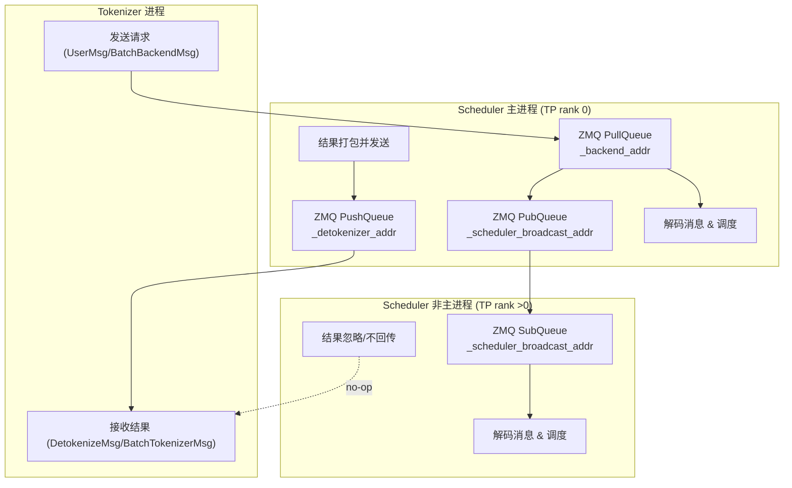

# Mini-SGlang

## Process Architecture

整体的架构：

1. API server 

负责提供OpenAI Compatible的API服务/朴素的Generate API

2. tokenizer worker

负责将输入的Frontend Message transform为token ids。对于OpenAI Message List，需要先通过chat_template进行转换。

通过num_tokenizer配置worker process数。

3. scheduler worker

核心模块，负责LLM推理循环

- 接收 tokenizer 的输入、组织 batch、管理 KV cache/页表、调用 Engine 做前向与采样、产出 token 并回传给 detokenizer。 
- 它同时承担 “请求生命周期管理”（从进入、prefill、decode、结束、回收资源）。
- 通过tp size配置worker process数。

4. detokenizer worker

负责接受scheduler的输出token ids，转换为字符串并返回给API Server。

## 基于TensorParallel的执行流程

考虑一个 $Y=X \times W $ 的矩阵乘( $W \in \mathbb{R}^{a \times c}$ )，其中 $X \in \mathbb{R}^{a \times b}$， $Y \in \mathbb{R}^{b \times c}$。

在TP执行时，可以采用对 $W$ 的不同纬度上进行切分。

- Row Parallel

Row Parallel 是对 $W$ 的第一维(Row方向)进行切分策略。采用这个策略时，$X$ 也同样会进行切分。假设TP=2，切分后的两个矩阵变为 $X=\begin{bmatrix} X_1 & X_2 \end{bmatrix}$ 和 $W=\begin{bmatrix} W_1 \\ W_2 \end{bmatrix}$。两个GPU分别计算 $Y_1=X_1 \times W_1$ 和 $Y_2=X_2 \times W_2$，最终结果需要一次All Reduce (Sum) 操作进行合并， $Y=Y_1 + Y_2$。

<!--  -->

- Column Parallel

Column Parallel 是对 W 的第二维(Column方向)进行切分策略。采用这个策略时，$X$ 不进行切分, $W$ 则被切分为 $W=\begin{bmatrix} W_1 & W_2 \end{bmatrix}$。两个GPU分别计算, $Y_1=X \times W_1$ 和 $Y_2=X \times W_2$，最后的结果需要一个Concat操作进行合并， $Y=\begin{bmatrix} Y_1 & Y_2 \end{bmatrix}$。

<!--  -->

通过TP可以将权重切分到不同的GPU上，降低显存压力，并且通过多GPU提高计算速度，不依赖于较大的Batch来打满GPU。

因而它主要适用于模型较大(需要切分weight）/单次GEMM计算量较大(重复使用多GPU/提高计算速度）/batch较小的场景(并没有大Batch来打满GPU）。

因为通讯带宽/延迟要求高，TensorParallel通常是跑在单节点上，依赖卡间的高速NVLink。

- Indexing Layer 的TP策略

根据TP size，以vocab_size纬度进行切分，然后不同的Rank各自完成Embedding的查找。如果当前的Rank的Embedding没有命中，则直接将Embedding置为0。

每一个Token只能够在一个GPU上找到自己的Embedding，其他都为0，因而最后可以通过一次all reduce操作完成Embedding的合并。

- Transformer Block的TP策略

一个标准的Transformer block可以抽象为以下的计算流程：

$$
X \xrightarrow[]{\text{QKV}} Q,K,V \xrightarrow[]{\text{Attention}} O \xrightarrow[]{W_o} Y \xrightarrow[]{\text{FFN}} Z
$$

- Attention Layer 的策略

QKV 投影($W_Q, W_K, W_V$) 采用 Column Parallel， 而Attention Layer输出($W_O$) 采用 Row Parallel。

QKV的投影计算通常是基于一个大的矩阵乘法完成，如下：

$$
[Q,K,V] = XW_{qkv}, \quad W_{qkv}\in\mathbb{R}^{H\times 3H}
$$

multi_head_attention的计算流程中，不同Head的Projection/Attention的计算也是天然可以切分到不同的卡上，也是可以直接可以基于ColumnParallel完成。$W_{qkv}$ 可以被切分为 $p$ 个部分，每个部分的大小为 $\frac{3H}{p}$。然后各自在不同的卡上，完成各自的Attention的计算。

$$
W_{qkv}=
\begin{bmatrix}
W_{qkv}^{(1)} & W_{qkv}^{(2)} & \cdots & W_{qkv}^{(p)}
\end{bmatrix},
\quad
W_{qkv}^{(i)}\in\mathbb{R}^{H\times \frac{3H}{p}}
$$

$$
O_i = \text{Attention}(Q_i,K_i,V_i)
$$

  - Attention Output projection：Row Parallel
- FFN Layer
  - FFN Up projection：Column Parallel
  - FFN Down projection：Row Parallel

基于这个策略，仅需两次的ALl Reduce (分别发生在Attention Layer和FFN Layer) 操作即可完成整个Transformer Block的计算。

- Embedding Layer

- Transformer-Block.Attention Layer

MultiHeadAttention的计算流程中，不同Head的Q/K/V Projection，天然就是Column Parallel，不同的GPU上完成各自的不同的Head Attention的计算。

Attention的Output Projection采用Row Parallel，各自Head Attention的输出和 $W_O$ Projection 的输入一样，是分片到不同的GPU上。

- Transformer-Block.FFN Layer

Column Parall

Row Parallel 获取的数据并不能使用，需要一次All Reduce？ Column Parallel完成后每一个GPU上获取的是

## 单个请求的执行流程（没有TP）

## KV Cache Management

## Tensor Parallel下的流程

## Overlap Scheduling

## 针对于Inference优化的CustomKernel

- pynccl

## Questions:

- LLM Inference Server的架构

- 什么是multi token prediction

- Overlap Scheduling是啥

- 如何做的Distribute Serving?

- CUDA Graphs 如何集成?

- KVCache 如何管理？

- Prefill vs Decode

- why pynccl?

overhead of pytorch distirbuted? 如何体现出来呢?

- 具体的kernel实现

- 显存管理:

主要哪些模块使用了显存，使用了多少的显存

- nccl 通讯中是否需要使用到显存

- nvShmem vs nccl

前者直接通过kernel中进行

- 具体的Kernel算子 in mini-sglang

- TP 是如何执行的

模型切分， 为什么QKV的projecton/FFN的第一次projection是Row Parallel的，而Attention/FFN的第二次投影是采用Column Parallel的？

考虑一个 $Y=X \times W $ 的矩阵乘( $W \in \mathbb{R}^{W \times Y}$ )，其中 $X \in \mathbb{R}^{X \times Z}$， $Y \in \mathbb{R}^{Y \times Z}$。

在TP执行时，可以采用对 $W$ 的不同纬度上进行切分。

- Row Parallel

Row Parallel 是对 W 的第一维(Row方向)进行切分策略。采用这个策略时，$X$ 也同样会进行切分。假设TP=2，切分后的两个矩阵变为 $X=\begin{bmatrix} X_1 & X_2 \end{bmatrix}$ 和 $W=\begin{bmatrix} W_1 \\ W_2 \end{bmatrix}$。两个GPU分别计算 $Y_1=X_1 \times W_1$ 和 $Y_2=X_2 \times W_2$，最终结果需要一次All Reduce (Sum) 操作进行合并， $Y=Y_1 + Y_2$。

- Column Parallel

Column Parallel 是对 W 的第二维(Column方向)进行切分策略。采用这个策略时，$X$ 不进行切分, $W$ 则被切分为 $W=\begin{bmatrix} W_1 & W_2 \end{bmatrix}$。两个GPU分别计算, $Y_1=X \times W_1$ 和 $Y_2=X \times W_2$，最后的结果需要一个Concat操作进行合并， $Y=\begin{bmatrix} Y_1 & Y_2 \end{bmatrix}$。

- Transformer Block的TP策略

一个标准的Transformer block可以抽象为以下的计算流程：

$$
X \xrightarrow[]{\text{QKV}} Q,K,V \xrightarrow[]{\text{Attention}} O \xrightarrow[]{W_o} Y \xrightarrow[]{\text{FFN}} Z
$$

整个流程中，通常采用以下的TP策略：

- Attention Layer

QKV 投影($W_Q, W_K, W_V$) 采用 Column Parallel， 而Attention Layer输出($W_O$) 采用 Row Parallel。

  - Attention Output projection：Row Parallel
- FFN Layer
  - FFN Up projection：Column Parallel
  - FFN Down projection：Row Parallel

基于这个策略，仅需两次的ALl Reduce (分别发生在Attention Layer和FFN Layer) 操作即可完成整个Transformer Block的计算。

- Embedding Layer

- Transformer-Block.Attention Layer

MultiHeadAttention的计算流程中，不同Head的Q/K/V Projection，天然就是Column Parallel，不同的GPU上完成各自的不同的Head Attention的计算。

Attention的Output Projection采用Row Parallel，各自Head Attention的输出和 $W_O$ Projection 的输入一样，是分片到不同的GPU上。

- Transformer-Block.FFN Layer

Column Parall

Row Parallel 获取的数据并不能使用，需要一次All Reduce？ Column Parallel完成后每一个GPU上获取的是

- Workload 分析？

- Batch 的问题

- Prefill/Decode

- KVCache 如何store

- 整个计算的流程中（Prefill/ChunkPrefill/Decode）如何复用已有的KVCache呢？

整体上，这里能够减少多少的FLOPS呢？如何验证这个流程?

