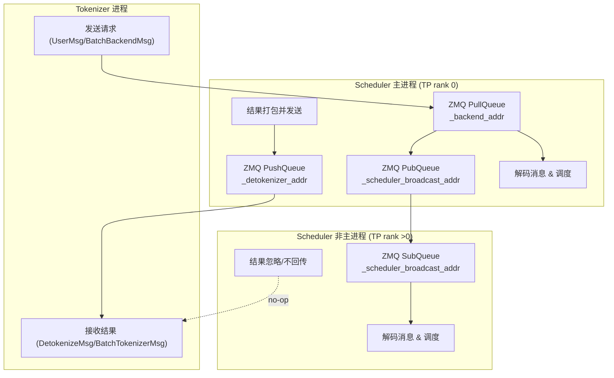

# Mini-SGlang

## Process Architecture

整体的架构：

1. API server 

负责提供OpenAI Compatible的API服务/朴素的Generate API

2. tokenizer worker

负责将输入的Frontend Message transform为token ids。对于OpenAI Message List，需要先通过chat_template进行转换。

通过num_tokenizer配置worker process数。

3. scheduler worker

核心模块，负责LLM推理循环

- 接收 tokenizer 的输入、组织 batch、管理 KV cache/页表、调用 Engine 做前向与采样、产出 token 并回传给 detokenizer。 
- 它同时承担 “请求生命周期管理”（从进入、prefill、decode、结束、回收资源）。
- 通过tp size配置worker process数。

4. detokenizer worker

负责接受scheduler的输出token ids，转换为字符串并返回给API Server。

## Questions:

- LLM Inference Server的架构

- 什么是multi token prediction

- Overlap Scheduling是啥

- 如何做的Distribute Serving?

- CUDA Graphs 如何集成?

- KVCache 如何管理？

- pynccl

- 具体的kernel实现

- 显存管理:

主要哪些模块使用了显存，使用了多少的显存

- nccl 通讯中是否需要使用到显存

- nvShmem vs nccl

前者直接通过kernel中进行
