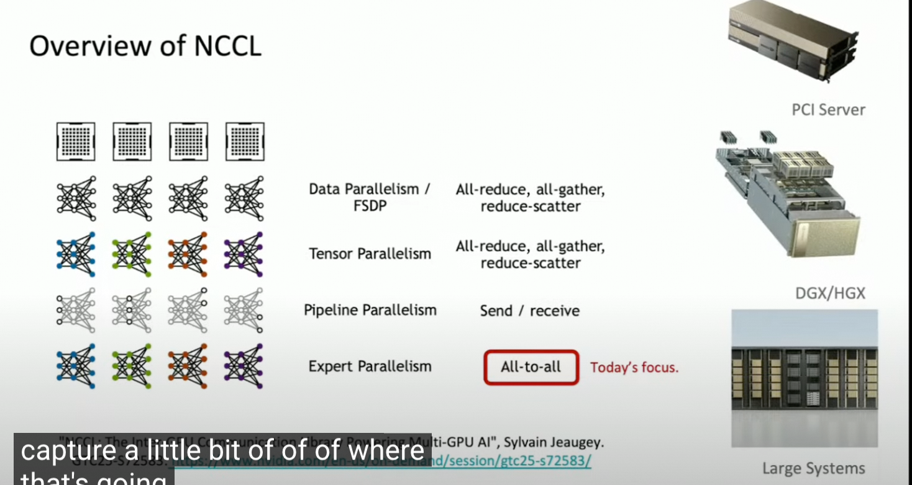

# NCCL and NVSHMEM


## Overview of NCCL and NVSHMEM




NVSHMEM 是OpenSHMEM在NVIDIA GPU上的实现，提供了跨节点，跨GPU的内存共享操作能力。相对于NCCL，他主要是针对于小的，碎片化的通讯需求，并且天然支持Device端调用，能够规避kernel launch的overhead，实现计算与存储的交织。

比较典型的使用场景：

Custom Communication Kernel (EP parallel)


example CUDA Kernel

```CPP

extern "C" __global__
void gnn_kernel(float* __restrict__ sym_features,
                float* __restrict__ sym_scratch,     // [2][CHUNK_ELEMS]
                unsigned long long* __restrict__ sym_flags,
                /* more args: neighbor lists, peer ids, etc. */) {

  const int wid  = threadIdx.x / warpSize;
  const int lane = threadIdx.x % warpSize;
  int ping = 0;

  // 预取第一批（通信 warp=0）
  if (wid == 0) {
    // 从 peer 的对称内存拉取下一批特征到本地双缓冲（非阻塞）
    nvshmem_getmem_nbi(&sym_scratch[ping * CHUNK_ELEMS],
                       remote_ptr_for_next_batch,      // 远端对称地址
                       CHUNK_ELEMS * sizeof(float),
                       peer_id);
  }

  // 主循环
  for (int step = 0; step < T; ++step) {
    // 计算 warp：处理上一个缓冲（与通信 warp 的下一批预取并发）
    if (wid != 0) {
      consume_features(&sym_scratch[(1 - ping) * CHUNK_ELEMS], /*...*/);
    }

    // 通信 warp：预取下一批（非阻塞 RMA）
    if (wid == 0) {
      nvshmem_getmem_nbi(&sym_scratch[ping * CHUNK_ELEMS],
                         remote_ptr_for_next_batch,    // 基于不规则索引计算得到
                         CHUNK_ELEMS * sizeof(float),
                         peer_id);
    }

    // 在需要“用到刚取回的数据”之前，确保完成
    if (wid == 0) nvshmem_quiet();   // 完成本 PE 发起的 RMA，保证本地可见
    __syncthreads();                 // 让所有 warp 都看到已就绪的数据
    ping = 1 - ping;

    // 每 N 步做一次全局 reduce（两种方式 二选一）：
    if ((step + 1) % N == 0) {
      // 方式 A（全设备内）：调用 NVSHMEM 的设备端 reduce（需 collective launch）
      // nvshmemx_sum_reduce_block(NVSHMEM_TEAM_WORLD, dst, src, count); // 示意，实际签名见文档

      // 方式 B：把局部统计写到对称内存/常规显存，由主机端发起 NCCL allreduce
      // （保留与 DL 框架集成的简洁性）
    }
  }
}


```


## References

- [NCCL](https://github.com/NVIDIA/nccl)

