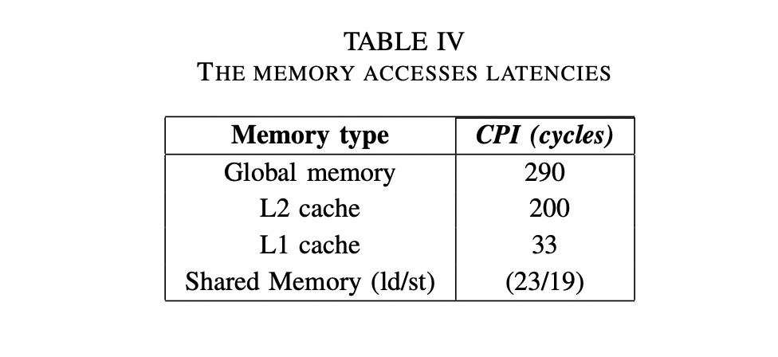

# Nvidia GPU

## GPU Architecture

## 使用SharedMemory

SharedMemory 是GPU上的片上缓存，和L1 cache是复用一份同一份物理内存，每一个SM独立持有一个一份SRAM。访问SharedMemory的周期大概是[20~30 cycles](https://arxiv.org/abs/2208.11174),而访问显存HBM则需要 300+ cycles.

| 特性  | 含义  | 性能影响 / 约束 |
| --- | --- | --- |
| 块级可见（per-block）| 一块 shared memory 分配给整个 Block，Block 内所有线程都能访问 | 容量受限／区分多个 block 时隔离 |
| 寄存器外的 “显式缓存 / scratchpad” | 可以把全局内存数据加载到 shared memory，然后由多线程重用 | 减少对全局内存的重复访问，降低内存带宽压力 |
| 分银行（memory banks） | shared memory 被拆成多个 bank（通常 32 个 bank）并行访问 | warp 内多个线程若访问同一 banking 会引入 bank conflict，造成串行化访问 |
| 容量和配置受限 | 每个 SM（或每个 Block）上可用的 shared memory 大小有上限；| GPU 架构上可能还要在 shared / L1 cache 之间做折分配置 如果申请过大会限制并发 block 数／降低 occupancy；部分架构允许在 shared 与 L1 间切换配置 |
| 需要同步（__syncthreads） | 因为多个线程对 shared memory 的读写可能交叉，需要插入同步点来避免 race | 多次同步会引入开销，必须小心放在正确的位置  |

## Question

- Tiling in GEMM

- torch.compile 生成的算子是实时的吗?

如何流程是什么样的？

- SM/SMSP

在Ampere/Hooper架构之后，Nvidia将SM（Streaming Multiprocessor）拆分为 SMSP （Streaming Multiprocessor Sub Partition）。SP 上配备了自己的Warp Scheduler/Register File/执行管线/L0指令缓存，一个Warp被固定到一个SP中执行。在一个SM上，资源越来越多/拥挤的情况下，使用多个warp Scheduler（Per SMSP）来提交Warp的调度执行效率，减少资源竞争，提高locality（指令与寄存器文件）。

- 变量是在SharedMemroy/还是RegisterFile上？如何决定的？

寄存器：编译器自动分配，开发者几乎不可直接控制，只能通过编译参数和代码习惯间接影响。
共享内存：完全由程序员通过 __shared__ 显式控制。

## References

- [Demystifying the Nvidia Ampere Architecture through Microbenchmarking and Instruction-level Analysis](https://arxiv.org/abs/2208.11174)

- [What IS a GPU](https://jax-ml.github.io/scaling-book/gpus/#what-is-a-gpu)
- [NVIDIA Tensor Core 的演变：从 Volta 到 Blackwell](https://zhuanlan.zhihu.com/p/1920552087932081548)